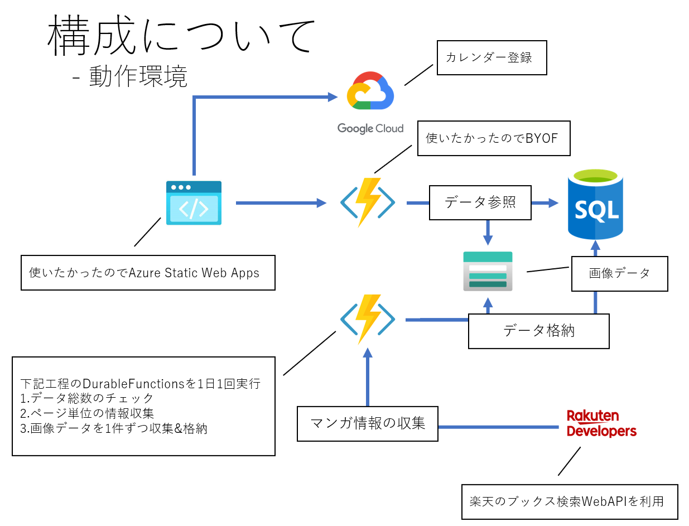

# まんがリマインダー(α)

## 展開先

https://manrem.devtakas.jp/

## 構成



# 開発について

自分が別環境で開発するときの備忘録的な…

## 開発環境

- @angular/cli
  - ^13.0.0
- Azure Functions Core Tools
- @azure/static-web-apps-cli
- VisualStudio
  - Visual Studio CodeでもOK
- SQL Server
  - localdbでOK
- Azure Cosmos DB（サーバーレスモード推奨）
- Azure Blob Storage
- Azure CLI（セットアップ用）

## Web開発

### 初期セットアップ

#### 1. Cosmos DB のセットアップ

Cosmos DB データベースとコンテナを作成します：

```powershell
# Azure CLI でログイン（初回のみ）
az login

# セットアップスクリプトを実行
cd scripts
.\setup-cosmosdb.ps1 -CosmosAccountName "<your-cosmos-account-name>" -ResourceGroupName "<your-resource-group-name>"
```

スクリプトは以下を自動的に作成します：
- データベース: `ComiCalDB`
- コンテナ: `comics`（パーティションキー: `/id`、インデックス最適化済み）
- コンテナ: `config-migrations`（パーティションキー: `/id`）

スクリプト実行後、表示される接続文字列を設定ファイルに追加してください。

#### 2. Blob Storage のセットアップ

Azure Portal または Azure CLI で Blob Storage アカウントを作成し、コンテナ `images` を作成してください。

#### 3. 設定ファイルのセットアップ

テンプレートファイルをコピーして、実際の接続文字列を設定します：

**API層の設定** (`api/local.settings.json`):
```bash
# テンプレートからコピー
cp api/local.settings.json.template api/local.settings.json
```

```json
{
  "IsEncrypted": false,
  "Values": {
    "AzureWebJobsStorage": "UseDevelopmentStorage=true",
    "FUNCTIONS_WORKER_RUNTIME": "dotnet",
    "CosmosConnectionString": "AccountEndpoint=https://<account-name>.documents.azure.com:443/;AccountKey=<your-key>;",
    "StorageConnectionString": "DefaultEndpointsProtocol=https;AccountName=<storage-account>;AccountKey=<your-key>;EndpointSuffix=core.windows.net"
  },
  "ConnectionStrings": {
    "DefaultConnection": "Server=(localdb)\\mssqllocaldb;Database=ComiCalDB;Trusted_Connection=True;"
  }
}
```

**Batch層の設定** (`batch/local.settings.json`):
```bash
# テンプレートからコピー
cp batch/local.settings.json.template batch/local.settings.json
```
設定内容は API 層と同じです。

**フロントエンド環境設定** (`front/src/environments/environment.ts`):
```typescript
export const environment = {
  production: false,
  gapiClientId: '<your-google-client-id>',
  blobBaseUrl: 'https://<storage-account>.blob.core.windows.net/images'
};
```

**環境変数一覧**:

| 変数名 | 説明 | 例 |
|--------|------|-----|
| `CosmosConnectionString` | Cosmos DB 接続文字列 | `AccountEndpoint=https://...;AccountKey=...;` |
| `StorageConnectionString` | Blob Storage 接続文字列 | `DefaultEndpointsProtocol=https;AccountName=...` |
| `DefaultConnection` | SQL Server 接続文字列（オプション） | `Server=(localdb)\\mssqllocaldb;...` |
| `blobBaseUrl` | Blob Storage の画像ベースURL | `https://<account>.blob.core.windows.net/images` |

> **セキュリティ注意**: 本番環境では、接続文字列に AccountKey を使用するのではなく、Azure Managed Identity や Azure AD 認証の使用を推奨します。これにより、設定ファイルに機密情報を保存する必要がなくなります。

#### 4. ローカル開発実行

1. apiデバッグ実行/apiディレクトリで`func start`
2. frontディレクトリで`npm run start`
3. frontディレクトリで`npm run start:swa`
4. http://localhost:4280