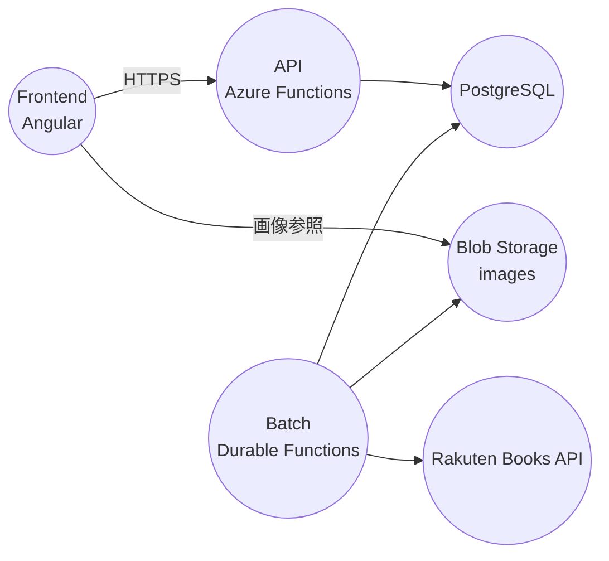

# まんがリマインダー(α)

展開先: https://manrem.devtakas.jp/

Angular（フロント）から Azure Functions（API）を呼び出して発売予定の漫画を検索し、
Batch（Durable Functions）が楽天ブックスAPIからデータ/画像を定期取得して PostgreSQL と Blob Storage に保存します。

## アーキテクチャ概要



**主要技術スタック**:
- **フロントエンド**: Angular 17, Azure Static Web Apps
- **API**: Azure Functions (.NET 10 LTS + Isolated worker model), PostgreSQL
- **Batch**: Azure Durable Functions (.NET 10 LTS + Isolated worker model), Blob Storage
- **外部API**: 楽天ブックスAPI

- フロントエンド: Angular（package.json上は Angular 21 系）
- API/Batch: Azure Functions v4 / dotnet-isolated（プロジェクトは net10.0）
- DB: PostgreSQL（Dev Container は `postgres:15-alpine`）
- ストレージ: Azure Blob Storage（ローカルは Azurite）
- 外部API: 楽天ブックスAPI

補足: 共有モジュールに Cosmos DB クライアントが残っていますが、コメント上は移行完了後に削除予定の扱いです。

## ディレクトリ構成

- `src/front`: フロントエンド（Angular）
- `src/api/Comical.Api`: API層（Functions）
- `src/batch/ComiCal.Batch`: Batch層（Durable Functions）
- `src/ComiCal.Server/ComiCal.Shared`: API/Batch 共有の設定・モデル等
- `database`: PostgreSQL 初期化SQL、スキーマ説明、シード
- `scripts`: 補助スクリプト

## ローカル開発（Dev Container 推奨）

### 1) Dev Container で起動

Dev Container を開くと、同一 compose ネットワーク上で以下が利用されます。

- PostgreSQL: `postgres:5432`（DB: `comical` / user: `comical`）
- Azurite: `azurite:10000`（Blob）/ `10001`（Queue）/ `10002`（Table）

動作確認用スクリプト:

```bash
./test-devcontainer.sh
./test-services.sh
```

### 2) 設定ファイル（Functions）

テンプレートをコピーして利用します（Dev Container のサービス名を前提に設定済み）。

```bash
cp src/api/local.settings.json.template src/api/local.settings.json
```

```json
{
  "IsEncrypted": false,
  "Values": {
    "AzureWebJobsStorage": "UseDevelopmentStorage=true",
    "FUNCTIONS_WORKER_RUNTIME": "dotnet-isolated",
    "PostgresConnectionString": "Host=localhost;Port=5432;Database=comical;Username=postgres;Password=password",
    "StorageConnectionString": "DefaultEndpointsProtocol=https;AccountName=<storage-account>;AccountKey=<your-key>;EndpointSuffix=core.windows.net"
  }
}
```

**Batch層の設定** (`src/batch/local.settings.json`):

```bash
# テンプレートからコピー
cp src/batch/local.settings.json.template src/batch/local.settings.json
```

Batch は楽天APIの `applicationid` を必要とします（`src/batch/local.settings.json` に設定）。

### 3) 起動（API / Batch / Front）

API（既定ポート 7071）:

```bash
cd src/api/Comical.Api
func start
```

Batch（APIと併走する場合はポートを変える）:

| 変数名 | 説明 | 例 |
|--------|------|-----|
| `PostgresConnectionString` | PostgreSQL 接続文字列（ローカル開発） | `Host=localhost;Port=5432;Database=comical;Username=postgres;Password=password` |
| `PostgresConnectionString` | PostgreSQL 接続文字列（Azure with Managed Identity） | `Host=<server>.postgres.database.azure.com;Database=comical;Username=<managed-identity-name>` |
| `StorageConnectionString` | Blob Storage 接続文字列 | `DefaultEndpointsProtocol=https;AccountName=...` |
| `blobBaseUrl` | Blob Storage の画像ベースURL | `https://<account>.blob.core.windows.net/images` |

> **セキュリティ注意**: 本番環境では、接続文字列にパスワードを含めるのではなく、Azure Managed Identity を使用することを強く推奨します。これにより、設定ファイルに機密情報を保存する必要がなくなり、自動的にローテーションされる資格情報を使用できます。

#### .NET 10 Isolated移行後の設定

プロジェクトは .NET 10 LTS と Isolated worker model に移行されています。以下の設定手順に従ってください：

**手順**:

1. **local.settings.jsonを作成** (テンプレートからコピー)

```bash
# API層
cp src/api/local.settings.json.template src/api/local.settings.json

# Batch層
cp src/batch/local.settings.json.template src/batch/local.settings.json
```

2. **FUNCTIONS_WORKER_RUNTIMEを`dotnet-isolated`に設定**
   
local.settings.json内で以下を確認してください：

```json
"FUNCTIONS_WORKER_RUNTIME": "dotnet-isolated"
```

> **重要**: .NET 10 Isolated worker modelを使用するため、`dotnet-isolated`の設定が必須です。

3. **ローカル開発: StorageConnectionStringのみ設定 (Azurite)**
   
ローカル開発環境では、Azuriteを使用します：

```json
"StorageConnectionString": "DefaultEndpointsProtocol=http;AccountName=devstoreaccount1;AccountKey=Eby8vdM02xNOcqFlqUwJPLlmEtlCDXJ1OUzFT50uSRZ6IFsuFq2UVErCz4I6tq/K1SZFPTOtr/KBHBeksoGMGw==;BlobEndpoint=http://azurite:10000/devstoreaccount1;QueueEndpoint=http://azurite:10001/devstoreaccount1;TableEndpoint=http://azurite:10002/devstoreaccount1;"
```

> **注**: 上記はAzuriteの標準的な開発用接続文字列です。local.settings.json.templateから完全な接続文字列を確認してください。

4. **Azure環境: StorageAccountNameを追加してManaged Identity有効化**
   
Azure環境では、Managed Identityを使用することを推奨します：
- `StorageAccountName` を設定してManaged Identity認証を有効化
- `StorageConnectionString` はフォールバック用に保持

Application Settingsでの設定例：

```
StorageAccountName=<your-storage-account-name>
StorageConnectionString=DefaultEndpointsProtocol=https;AccountName=<account>;AccountKey=<key>;...
```

5. **AzureWebJobsStorageは接続文字列形式を継続**
   
Durable Functions互換性のため、`AzureWebJobsStorage`は接続文字列形式を維持します：
```json
"AzureWebJobsStorage": "DefaultEndpointsProtocol=https;AccountName=<account>;AccountKey=<key>;..."
```

6. **Azure Functions Core Tools v4を使用**
   
開発には Azure Functions Core Tools v4 を使用してください：

```bash
# バージョン確認
func --version  # 4.x.x であることを確認

# インストール（必要な場合）
npm install -g azure-functions-core-tools@4 --unsafe-perm true
```

#### 4. ローカル開発実行

**前提条件**:
- PostgreSQLが起動していること（Docker: `docker start comical-postgres`）
- Azurite（ローカルストレージエミュレータ）が起動していること

**実行手順**:
1. apiデバッグ実行/apiディレクトリで`func start`
2. frontディレクトリで`npm run start`
3. frontディレクトリで`npm run start:swa`
4. http://localhost:4280

## 統合テストとデプロイ

### 統合テストの実行

詳細な統合テスト手順は [統合テストガイド](./docs/INTEGRATION_TESTS.md) を参照してください。

**クイックスタート**:
```powershell
# すべてのテストを実行（ローカル環境）
cd scripts
.\test-integration.ps1 -Environment Local -RunAllTests

# API層のテストのみ実行
.\test-integration.ps1 -Environment Local -TestApi

# 開発環境でテスト実行
.\test-integration.ps1 -Environment Dev -RunAllTests
```

Front（APIは `proxy.conf.json` で `http://localhost:7071` に転送）:

```bash
cd src/front
npm install
npm run start
```

SWAローカル（必要な場合のみ）:

```bash
cd src/front
npm run start:swa
```

### 4) 画像表示（ローカル）

ローカルの画像URLは `src/front/src/environments/environment.ts` の `blobBaseUrl` で決まります。
Dev Container + Azurite の既定値は `http://localhost:10000/devstoreaccount1/images` です。

## ドキュメント

コードから判明した内容を /docs 配下に大項目ごとに最小限でまとめています。

- [docs/index.md](./docs/index.md)
- [docs/architecture.md](./docs/architecture.md)
- [docs/api.md](./docs/api.md)
- [docs/batch.md](./docs/batch.md)
- [docs/frontend.md](./docs/frontend.md)
- [docs/database.md](./docs/database.md)
- [docs/shared.md](./docs/shared.md)

DBスキーマの詳細: [database/SCHEMA.md](./database/SCHEMA.md)

## コンポーネントREADME

- API: [src/api/README.md](./src/api/README.md)
- Batch: [src/batch/README.md](./src/batch/README.md)
- Front: [src/front/README.md](./src/front/README.md)
- Scripts: [scripts/README.md](./scripts/README.md)

## ライセンス

このプロジェクトは個人プロジェクトです。