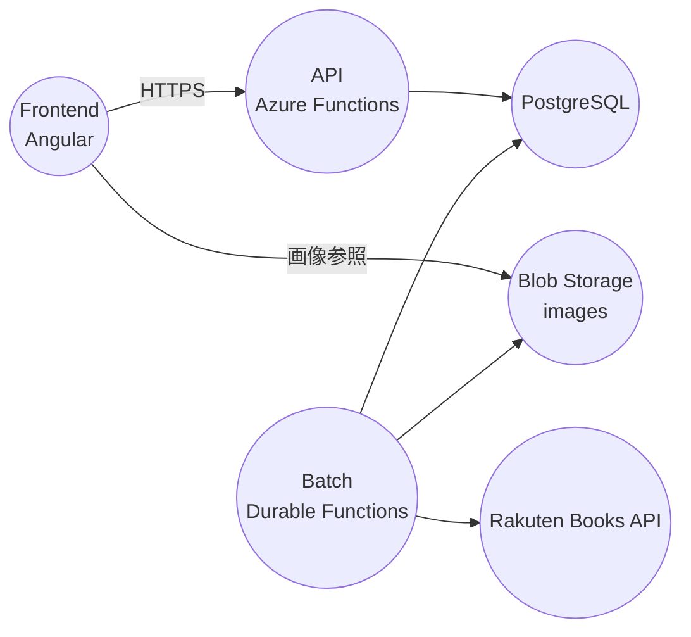

# まんがリマインダー(α)

展開先: https://manrem.devtakas.jp/

Angular（フロント）から Azure Functions（API）を呼び出して発売予定の漫画を検索し、
Batch（Durable Functions）が楽天ブックスAPIからデータ/画像を定期取得して PostgreSQL と Blob Storage に保存します。

## アーキテクチャ概要



## 技術スタック（現状）

- フロントエンド: Angular（package.json上は Angular 21 系）
- API/Batch: Azure Functions v4 / dotnet-isolated（プロジェクトは net10.0）
- DB: PostgreSQL（Dev Container は `postgres:15-alpine`）
- ストレージ: Azure Blob Storage（ローカルは Azurite）
- 外部API: 楽天ブックスAPI

補足: 共有モジュールに Cosmos DB クライアントが残っていますが、コメント上は移行完了後に削除予定の扱いです。

## ディレクトリ構成

- `src/front`: フロントエンド（Angular）
- `src/api/Comical.Api`: API層（Functions）
- `src/batch/ComiCal.Batch`: Batch層（Durable Functions）
- `src/ComiCal.Server/ComiCal.Shared`: API/Batch 共有の設定・モデル等
- `database`: PostgreSQL 初期化SQL、スキーマ説明、シード
- `scripts`: 補助スクリプト

## ローカル開発（Dev Container 推奨）

### 1) Dev Container で起動

Dev Container を開くと、同一 compose ネットワーク上で以下が利用されます。

- PostgreSQL: `postgres:5432`（DB: `comical` / user: `comical`）
- Azurite: `azurite:10000`（Blob）/ `10001`（Queue）/ `10002`（Table）

動作確認用スクリプト:

```bash
./test-devcontainer.sh
./test-services.sh
```

### 2) 設定ファイル（Functions）

テンプレートをコピーして利用します（Dev Container のサービス名を前提に設定済み）。

```bash
cp src/api/local.settings.json.template src/api/local.settings.json
cp src/batch/local.settings.json.template src/batch/local.settings.json
```

Batch は楽天APIの `applicationid` を必要とします（`src/batch/local.settings.json` に設定）。

### 3) 起動（API / Batch / Front）

API（既定ポート 7071）:

```bash
cd src/api/Comical.Api
func start
```

Batch（APIと併走する場合はポートを変える）:

```bash
cd src/batch/ComiCal.Batch
func start --port 7072
```

Front（APIは `proxy.conf.json` で `http://localhost:7071` に転送）:

```bash
cd src/front
npm install
npm run start
```

SWAローカル（必要な場合のみ）:

```bash
cd src/front
npm run start:swa
```

### 4) 画像表示（ローカル）

ローカルの画像URLは `src/front/src/environments/environment.ts` の `blobBaseUrl` で決まります。
Dev Container + Azurite の既定値は `http://localhost:10000/devstoreaccount1/images` です。

## ドキュメント

コードから判明した内容を /docs 配下に大項目ごとに最小限でまとめています。

- [docs/index.md](./docs/index.md)
- [docs/architecture.md](./docs/architecture.md)
- [docs/api.md](./docs/api.md)
- [docs/batch.md](./docs/batch.md)
- [docs/frontend.md](./docs/frontend.md)
- [docs/database.md](./docs/database.md)
- [docs/shared.md](./docs/shared.md)

DBスキーマの詳細: [database/SCHEMA.md](./database/SCHEMA.md)

## コンポーネントREADME

- API: [src/api/README.md](./src/api/README.md)
- Batch: [src/batch/README.md](./src/batch/README.md)
- Front: [src/front/README.md](./src/front/README.md)
- Scripts: [scripts/README.md](./scripts/README.md)

## ライセンス

このプロジェクトは個人プロジェクトです。