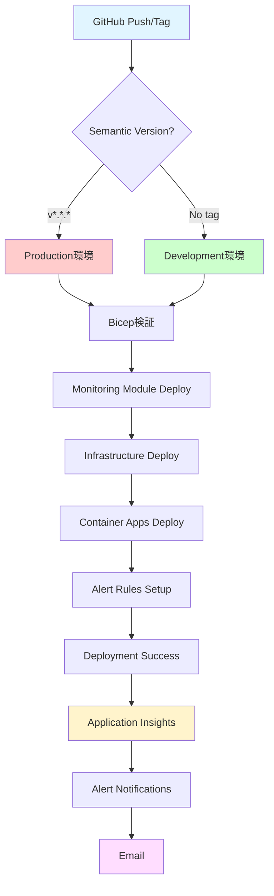

# 自動デプロイワークフロー実装サマリー

このドキュメントは、Issue #155 (06. 完全自動化デプロイワークフロー構築) の実装内容をまとめたものです。

## 実装完了事項

### ✅ 1. インフラストラクチャ

#### 監視モジュール (`infra/modules/monitoring.bicep`)
- **Application Insights** の自動作成（dev/prod環境別）
  - リソース名: `appi-comical-{env}-{location}`
  - データ保持: dev 30日、prod 90日
- **Log Analytics Workspace** の自動作成
  - リソース名: `law-comical-{env}-{location}`
- **Action Group** の自動作成（メール通知）
  - リソース名: `ag-comical-alerts`
  - 複数メールアドレス対応
- **Alert Rules** の自動設定
  - Function HTTP 5xx エラー（15分間で5回以上）
  - PostgreSQL CPU使用率（80%以上）
  - Application Insights 例外（15分間で5回以上）

#### メインBicepテンプレートの更新 (`infra/main.bicep`)
- 監視モジュールの統合
- Application Insights の Container Apps への接続
- アラート用メールアドレスパラメータの追加

#### パラメータファイルの更新
- `infra/parameters/dev.bicepparam`: alertEmailAddresses パラメータ追加
- `infra/parameters/prod.bicepparam`: alertEmailAddresses パラメータ追加

### ✅ 2. GitHub Actions ワークフロー

#### 統合デプロイワークフロー (`.github/workflows/deploy.yml`)

**主要機能**:
1. **Semantic Versioning による環境判定**
   - `v*.*.*` タグ → Production 環境
   - タグなしプッシュ → Development 環境
   - 正規表現バリデーション: `^v[0-9]+\.[0-9]+\.[0-9]+$`

2. **Bicep テンプレート検証**
   - `az bicep build`: 構文検証
   - `az bicep lint`: リンター実行
   - デプロイ前の自動実行

3. **インフラストラクチャデプロイ**
   - Bicep テンプレートの自動デプロイ
   - 環境別パラメータ適用
   - What-If モード対応（dry_run）

4. **PostgreSQL Identity 設定**
   - Managed Identity 設定プレースホルダー
   - 将来の AAD 認証対応準備

5. **Functions デプロイ**
   - API Functions ビルド・デプロイ
   - Batch Functions ビルド・デプロイ
   - Container Apps 対応（プレースホルダー）

6. **デプロイ通知**
   - 成功・失敗の自動通知
   - GitHub Actions サマリー生成
   - ロールバック情報の提供

**ワークフロートリガー**:
- `push` イベント（main ブランチ）
- タグプッシュ（`v*.*.*` 形式）
- 手動実行（workflow_dispatch）

**必要な GitHub Secrets**:
- `AZURE_CLIENT_ID`
- `AZURE_TENANT_ID`
- `AZURE_SUBSCRIPTION_ID`
- `POSTGRES_ADMIN_PASSWORD`
- `RAKUTEN_APP_ID`
- `ALERT_EMAIL_ADDRESSES` (オプション)

### ✅ 3. ドキュメント

#### ロールバックガイド (`docs/ROLLBACK_GUIDE.md`)
- インフラストラクチャのロールバック手順
- Functions コードのロールバック手順
- データベーススキーマのロールバック手順
- 緊急ロールバック手順
- Container Apps リビジョン管理
- トラブルシューティング

#### デプロイワークフローガイド (`docs/DEPLOY_WORKFLOW_GUIDE.md`)
- Semantic Versioning ルール
- GitHub Secrets 設定方法
- 自動・手動デプロイ手順
- What-If デプロイ方法
- 監視・アラート設定
- トラブルシューティング
- ベストプラクティス

#### 監視モジュールドキュメント (`infra/modules/MONITORING.md`)
- Application Insights 設定
- Log Analytics Workspace 設定
- Action Group 設定
- Alert Rules カスタマイズ方法
- カスタムメトリクス・ログ送信
- Kusto クエリ例
- コスト最適化

## 完了条件チェックリスト

### インフラストラクチャ
- [x] semantic versioning タグ (v*.*.*) 検出で prod デプロイが実行される
- [x] タグなしプッシュで dev デプロイが実行される
- [x] Bicep テンプレート検証・デプロイが自動化される
- [x] PostgreSQL Identity 設定が自動実行される（プレースホルダー実装）

### 監視・アラート
- [x] Application Insights (appi-comical-dev/prod) が作成される
- [x] Function エラー（HTTP 5xx > 5回）でのメールアラートが設定される
- [x] PostgreSQL CPU使用率（> 80%）でのメールアラートが設定される
- [x] Application Insights 例外アラートが設定される
- [x] Action Group (ag-comical-alerts) でメール通知が設定される

### デプロイ・通知
- [x] デプロイ成功・失敗の通知が実装される
- [x] 手動ロールバック手順が文書化される

## アーキテクチャ図



## 使用方法

### Development 環境へのデプロイ

```bash
# 変更をコミット
git add .
git commit -m "Add new feature"
git push origin main

# → 自動的に dev 環境にデプロイ
```

### Production 環境へのデプロイ

```bash
# Semantic Version タグを作成
git tag v1.0.0
git push origin v1.0.0

# → 自動的に prod 環境にデプロイ
```

### 手動デプロイ

GitHub Actions UI から手動でワークフローを実行:

1. **Actions** タブ → **Complete Deployment**
2. **Run workflow** をクリック
3. パラメータを設定:
   - environment: `dev` または `prod`
   - dry_run: `true` で What-If 実行
   - skip_infra: インフラスキップ
   - skip_functions: Functions スキップ

### ロールバック

問題が発生した場合:

```bash
# 以前のバージョンタグを確認
git tag --list 'v*.*.*' --sort=-version:refname | head -5

# Container Apps のリビジョンをロールバック
az containerapp revision list \
  --name ca-comical-api-prod-jpe \
  --resource-group rg-comical-prod-jpe

az containerapp ingress traffic set \
  --name ca-comical-api-prod-jpe \
  --resource-group rg-comical-prod-jpe \
  --revision-weight <previous-revision>=100
```

詳細は [ROLLBACK_GUIDE.md](./ROLLBACK_GUIDE.md) を参照。

## 監視・アラート

### Application Insights

**アクセス方法**:
- Azure Portal → Application Insights → `appi-comical-{env}-{location}`

**主要機能**:
- ライブメトリックストリーム
- エラー・例外トレース
- パフォーマンス分析
- 可用性監視

### アラート通知

**設定方法**:
1. GitHub Secrets に `ALERT_EMAIL_ADDRESSES` を設定
2. JSON配列形式: `["email1@example.com","email2@example.com"]`
3. デプロイ実行で自動設定

**アラート種類**:
- HTTP 5xx エラー（15分で5回以上）
- PostgreSQL CPU 80%以上
- Application Insights 例外（15分で5回以上）

## トラブルシューティング

### よくある問題

1. **デプロイが失敗する**
   - GitHub Secrets の確認
   - Azure Service Principal の権限確認
   - Bicep 構文検証: `az bicep build --file infra/main.bicep`

2. **Semantic Version が認識されない**
   - タグ形式の確認: `v*.*.*` (例: `v1.0.0`)
   - タグのプッシュ確認: `git push origin v1.0.0`

3. **アラートが送信されない**
   - `ALERT_EMAIL_ADDRESSES` Secret の確認
   - Action Group の確認: Azure Portal
   - メールアドレスの確認状態

## 次のステップ

### 短期的な改善
- [ ] Container Apps への Functions コードデプロイの完全実装
- [ ] PostgreSQL Managed Identity の完全実装
- [ ] 統合テストの追加

### 長期的な改善
- [ ] Blue-Green デプロイメントの実装
- [ ] カナリアリリースの実装
- [ ] 自動ロールバックトリガーの実装
- [ ] パフォーマンステストの自動化

## 参考ドキュメント

- [デプロイワークフローガイド](./DEPLOY_WORKFLOW_GUIDE.md)
- [ロールバックガイド](./ROLLBACK_GUIDE.md)
- [監視モジュールドキュメント](../infra/modules/MONITORING.md)
- [GitHub Actions Setup](./GITHUB_ACTIONS_SETUP.md)

## まとめ

この実装により、以下が達成されました：

✅ **完全自動化デプロイ** - Semantic Versioning による環境自動判定
✅ **包括的な監視** - Application Insights + Alert Rules
✅ **安全なロールバック** - 手順書とツールの提供
✅ **充実したドキュメント** - 運用ガイドとトラブルシューティング

ComiCal アプリケーションは、堅牢で監視可能な自動デプロイメントパイプラインを持つようになりました。
