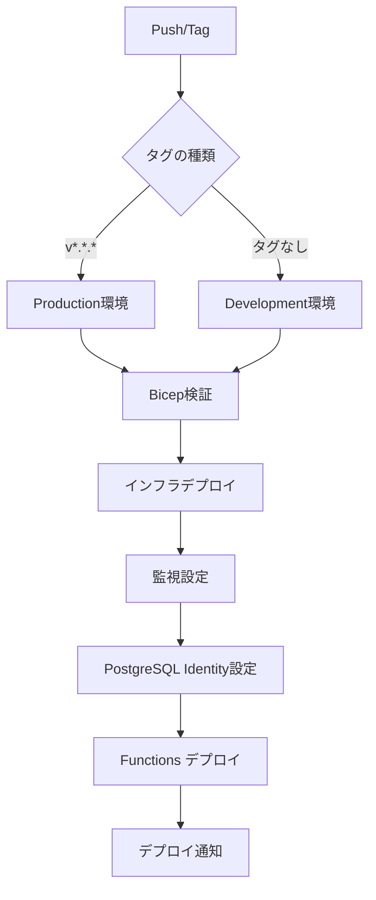

# 自動デプロイメントワークフローガイド

このドキュメントでは、ComiCal アプリケーションの完全自動化デプロイメントワークフローについて説明します。

## 概要

自動デプロイメントワークフロー (`.github/workflows/deploy.yml`) は、以下の機能を提供します：

1. **Semantic Versioning による環境判定** - タグに基づいた自動環境選択
2. **Bicep テンプレート検証** - デプロイ前の自動検証
3. **インフラストラクチャデプロイ** - Azure リソースの自動作成・更新
4. **監視・アラート設定** - Application Insights とアラートルールの自動設定
5. **デプロイ通知** - 成功・失敗の通知

## デプロイフロー



## Semantic Versioning ルール

### Production デプロイ

**トリガー条件**: `v*.*.*` 形式のタグがプッシュされた場合

```bash
# 例: v1.0.0 タグをプッシュして本番環境にデプロイ
git tag v1.0.0
git push origin v1.0.0
```

**検証ルール**:
- タグは `v` で始まる必要がある
- バージョン番号は `major.minor.patch` 形式（例: `v1.2.3`）
- 各番号は数字のみ（例: `v1.0.0` は有効、`v1.0.0-beta` は無効）

### Development デプロイ

**トリガー条件**: タグなしで `main` ブランチにプッシュされた場合

```bash
# 例: 通常の commit & push で開発環境にデプロイ
git add .
git commit -m "Update feature"
git push origin main
```

## GitHub Secrets の設定

デプロイワークフローを実行するには、以下の GitHub Secrets を設定する必要があります：

### 必須 Secrets

| Secret名 | 説明 | 例 |
|---------|------|-----|
| `AZURE_CLIENT_ID` | Azure Service Principal のクライアントID | `12345678-1234-1234-1234-123456789012` |
| `AZURE_TENANT_ID` | Azure テナントID | `87654321-4321-4321-4321-210987654321` |
| `AZURE_SUBSCRIPTION_ID` | Azure サブスクリプションID | `abcdef01-2345-6789-abcd-ef0123456789` |
| `POSTGRES_ADMIN_PASSWORD` | PostgreSQL 管理者パスワード | `StrongP@ssw0rd!` |
| `RAKUTEN_APP_ID` | 楽天ブックスAPI アプリケーションID | `1234567890123456` |

### オプション Secrets

| Secret名 | 説明 | 例 |
|---------|------|-----|
| `ALERT_EMAIL_ADDRESSES` | アラート通知先メールアドレス（JSON配列） | `["admin@example.com","ops@example.com"]` |
| `GITHUB_TOKEN` | Static Web Apps の GitHub 連携用トークン | 自動的に提供される |

### Secrets の設定方法

1. GitHub リポジトリに移動
2. **Settings** → **Secrets and variables** → **Actions** をクリック
3. **New repository secret** をクリック
4. **Name** と **Value** を入力
5. **Add secret** をクリック

## ワークフローの実行方法

### 1. 自動実行（推奨）

#### Development 環境への自動デプロイ

```bash
# 変更をコミットしてプッシュ
git add .
git commit -m "Add new feature"
git push origin main

# → 自動的に dev 環境にデプロイされる
```

#### Production 環境への自動デプロイ

```bash
# Semantic Version タグを作成
git tag v1.0.0
git push origin v1.0.0

# → 自動的に prod 環境にデプロイされる
```

### 2. 手動実行

GitHub Actions UI から手動でワークフローを実行できます。

**手順**:
1. GitHub リポジトリ → **Actions** タブ
2. **Complete Deployment** ワークフローを選択
3. **Run workflow** をクリック
4. パラメータを設定:
   - **environment**: `dev` または `prod`
   - **dry_run**: `true` で What-If 実行（変更なし）
   - **skip_infra**: インフラデプロイをスキップ
   - **skip_functions**: Functions デプロイをスキップ
5. **Run workflow** をクリック

### 3. What-If デプロイ（変更のプレビュー）

実際にデプロイせずに、変更内容をプレビューできます。

**手順**:
1. GitHub Actions UI から手動実行
2. **dry_run** を `true` に設定
3. ワークフローを実行
4. ログで変更内容を確認

## デプロイプロセスの詳細

### ステップ 1: 環境判定

ワークフローは自動的に以下を判定します：

- **Environment**: `dev` または `prod`
- **Version**: Semantic Version タグ（存在する場合）
- **Is Semantic Version**: タグが有効な形式か

**ログ例**:
```
🎯 Target Environment: prod
📦 Version: v1.0.0
✅ Valid semantic version detected: v1.0.0
🏗️  Deploy Infrastructure: true
⚡ Deploy Functions: true
```

### ステップ 2: Bicep 検証

デプロイ前に Bicep テンプレートを検証します。

**実行内容**:
1. **Syntax Validation**: `az bicep build`
2. **Linter**: `az bicep lint`

**エラー例**:
```
❌ Bicep syntax validation failed
Error: Property 'invalidProperty' is not allowed on object of type 'Microsoft.Storage/storageAccounts'
```

### ステップ 3: インフラストラクチャデプロイ

Azure リソースをデプロイします。

**デプロイされるリソース**:
- Resource Group
- PostgreSQL Flexible Server
- Key Vault
- Storage Account
- Container Apps Environment
- API Container App
- Batch Container App
- Application Insights
- Log Analytics Workspace
- Action Group
- Alert Rules
- Static Web Apps
- CDN (Production のみ)
- Cost Optimization Logic Apps (Dev のみ)

**デプロイ時間**: 約10-15分

### ステップ 4: PostgreSQL Identity 設定

PostgreSQL の Managed Identity を設定します（現在はプレースホルダー）。

**将来の実装内容**:
- Container Apps の Managed Identity を PostgreSQL に登録
- AAD 認証の有効化

### ステップ 5: Functions デプロイ

API と Batch Functions をデプロイします（現在はプレースホルダー）。

**注意**: Container Apps への Functions デプロイは、コンテナイメージ戦略に依存します。

### ステップ 6: デプロイ通知

デプロイ結果を通知します。

**成功時の出力例**:
```
## ✅ Deployment Status: Deployment completed successfully

### Deployment Details
- Environment: prod
- Version: v1.0.0
- Semantic Version: true
- Triggered by: push
- Actor: @username

### Component Status
- Infrastructure: success
- API Functions: success
- Batch Functions: success
```

**失敗時の出力例**:
```
## ❌ Deployment Status: Deployment failed

### 🔄 Rollback Information
If you need to rollback this deployment, please refer to the Rollback Guide
```

## 監視とアラート

デプロイ後、自動的に以下の監視・アラートが設定されます：

### Application Insights

**リソース名**: `appi-comical-{env}-{location}`

**機能**:
- リクエスト/レスポンスのトレース
- 例外の追跡
- パフォーマンスメトリクス
- ライブメトリックストリーム

**確認方法**:
```bash
# Azure Portal で確認
# Application Insights → appi-comical-{env}-{location} → ライブメトリック
```

### アラートルール

デプロイ後、以下のアラートが自動的に設定されます：

#### 1. Function HTTP 5xx エラーアラート

**条件**: 15分間に5回以上の HTTP 5xx エラー

**通知**: 設定されたメールアドレスに通知

#### 2. PostgreSQL CPU使用率アラート

**条件**: CPU使用率が80%以上（15分間の平均）

**通知**: 設定されたメールアドレスに通知

#### 3. Application Insights 例外アラート

**条件**: 15分間に5回以上の例外

**通知**: 設定されたメールアドレスに通知

### アラート通知の設定

アラート通知を受け取るには、`ALERT_EMAIL_ADDRESSES` Secret を設定します：

```json
["admin@example.com", "ops-team@example.com"]
```

## トラブルシューティング

### デプロイが失敗する

**症状**: ワークフローが失敗し、エラーメッセージが表示される

**確認項目**:
1. GitHub Secrets が正しく設定されているか
2. Azure Service Principal に適切な権限があるか
3. Bicep テンプレートに構文エラーがないか
4. Azure サブスクリプションにクォータの余裕があるか

**解決方法**:
```bash
# Bicep テンプレートをローカルで検証
az bicep build --file infra/main.bicep

# Azure へのログインを確認
az login --service-principal \
  --username $AZURE_CLIENT_ID \
  --password $AZURE_CLIENT_SECRET \
  --tenant $AZURE_TENANT_ID

# サブスクリプションの設定を確認
az account show
```

### Semantic Version タグが認識されない

**症状**: Production 環境にデプロイされない

**確認項目**:
1. タグが `v*.*.*` 形式か
2. タグが GitHub にプッシュされているか

**解決方法**:
```bash
# タグの形式を確認
git tag --list 'v*.*.*'

# タグを再作成
git tag -d v1.0.0
git tag v1.0.0
git push origin v1.0.0 --force
```

### アラートが送信されない

**症状**: アラート条件を満たしているが通知が来ない

**確認項目**:
1. `ALERT_EMAIL_ADDRESSES` Secret が設定されているか
2. メールアドレスが確認済みか
3. Action Group が正しく作成されているか

**解決方法**:
```bash
# Action Group の状態を確認
az monitor action-group show \
  --name ag-comical-alerts \
  --resource-group rg-comical-prod-jpe

# テストメールを送信
az monitor action-group test-notifications create \
  --action-group-name ag-comical-alerts \
  --resource-group rg-comical-prod-jpe \
  --alert-type email
```

### PostgreSQL Identity 設定エラー

**症状**: PostgreSQL への接続でエラーが発生する

**確認項目**:
1. Container Apps の Managed Identity が有効か
2. PostgreSQL のファイアウォール設定が正しいか

**解決方法**:
```bash
# Container App の Managed Identity を確認
az containerapp show \
  --name ca-comical-api-prod-jpe \
  --resource-group rg-comical-prod-jpe \
  --query "identity"

# PostgreSQL ファイアウォールルールを確認
az postgres flexible-server firewall-rule list \
  --name psql-comical-p-jpe \
  --resource-group rg-comical-prod-jpe
```

## ベストプラクティス

### 1. バージョニング戦略

推奨される Semantic Versioning の使い方：

- **Major (v1.0.0 → v2.0.0)**: 破壊的変更
- **Minor (v1.0.0 → v1.1.0)**: 新機能追加（後方互換性あり）
- **Patch (v1.0.0 → v1.0.1)**: バグフィックス

### 2. デプロイ前の確認

本番環境にデプロイする前に：

1. **Dev 環境でテスト**: まず dev 環境でテスト
2. **What-If 実行**: `dry_run: true` で変更内容を確認
3. **バックアップ**: データベースのバックアップを取得
4. **ロールバック計画**: ロールバック手順を確認

### 3. デプロイ後の確認

デプロイ後は必ず以下を確認：

1. **Application Insights**: ライブメトリックで動作確認
2. **エンドポイント**: API エンドポイントの疎通確認
3. **アラート**: アラートルールが正しく設定されているか
4. **ログ**: エラーログがないか確認

### 4. 定期的なメンテナンス

- **月次**: アラートルールの見直し
- **四半期**: リソースのコスト最適化レビュー
- **半年**: セキュリティ設定の見直し

## 参考リンク

- [GitHub Actions ドキュメント](https://docs.github.com/actions)
- [Azure Bicep ドキュメント](https://learn.microsoft.com/azure/azure-resource-manager/bicep/)
- [Semantic Versioning](https://semver.org/)
- [Azure Monitor ドキュメント](https://learn.microsoft.com/azure/azure-monitor/)
- [ロールバックガイド](../docs/ROLLBACK_GUIDE.md)
- [監視モジュールドキュメント](../infra/modules/MONITORING.md)

## まとめ

自動デプロイメントワークフローは、以下の利点を提供します：

✅ **Semantic Versioning による環境判定** - タグで自動的に環境を選択
✅ **自動検証** - デプロイ前に Bicep テンプレートを検証
✅ **一貫性のあるデプロイ** - 毎回同じ手順でデプロイ
✅ **監視・アラート自動設定** - Application Insights とアラートルールを自動作成
✅ **トラブルシューティング** - デプロイログとアラートで問題を早期発見

問題が発生した場合は、[ロールバックガイド](../docs/ROLLBACK_GUIDE.md) を参照してください。
