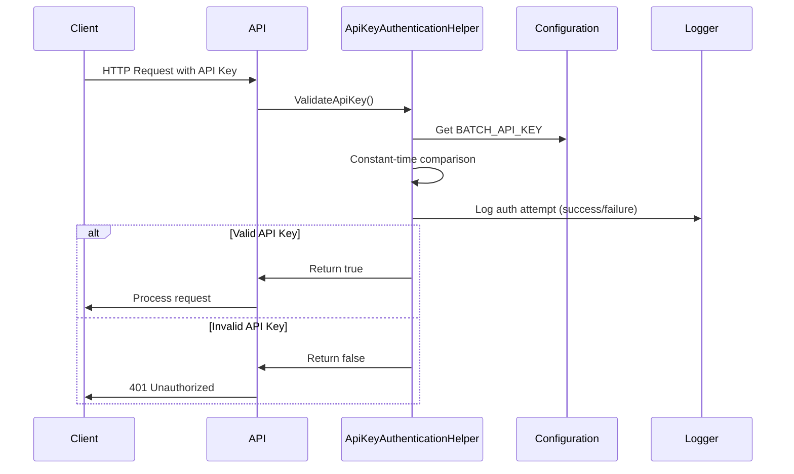
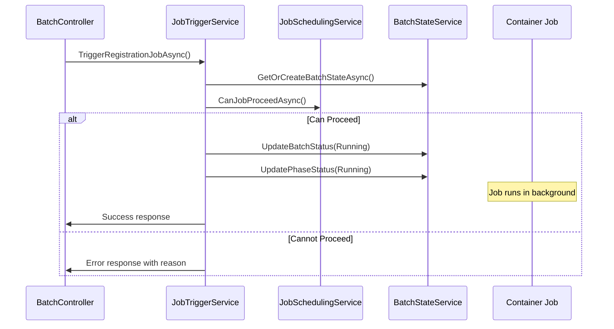

# Step 6: Manual Execution API Implementation Summary

## 実装完了日
2026-01-01

## 概要
Container Jobsの手動実行とページ範囲指定部分再実行機能を提供するHTTP APIを実装しました。

## 実装内容

### 1. API Endpoints (BatchController.cs)

実装されたエンドポイント:

| エンドポイント | メソッド | 説明 |
|-------------|---------|------|
| `/api/batch/registration` | POST | データ登録Job手動実行 |
| `/api/batch/images` | POST | 画像ダウンロードJob手動実行 |
| `/api/batch/registration/partial` | POST | ページ範囲指定部分再実行 |
| `/api/batch/reset-intervention` | POST | 手動介入解除・自動復帰設定 |

### 2. 認証・セキュリティ

実装された認証機能:
- **API Key認証**: HTTPヘッダー（`X-API-Key`）またはクエリパラメータ（`api_key`）で提供
- **定数時間比較**: タイミング攻撃対策
- **セキュリティログ**: すべての認証試行を記録（IPアドレス、パス、結果）
- **環境変数**: `BATCH_API_KEY` で設定

### 3. 新規ファイル

| ファイル | 説明 |
|---------|------|
| `Controllers/BatchController.cs` | API エンドポイント実装 |
| `Services/JobTriggerService.cs` | Job トリガーサービス |
| `Util/ApiKeyAuthenticationHelper.cs` | API Key 認証ヘルパー |
| `Models/BatchApiModels.cs` | リクエスト/レスポンスDTO |
| `docs/BATCH_API.md` | API ドキュメント |
| `scripts/test-batch-api.sh` | テストスクリプト |

### 4. 変更ファイル

| ファイル | 変更内容 |
|---------|---------|
| `Program.cs` | JobTriggerService をDI コンテナに登録 |
| `local.settings.json.template` | BATCH_API_KEY 設定を追加 |

## 技術仕様

### API Key認証フロー



### Job実行フロー



## セキュリティ対策

### 実装されたセキュリティ機能

1. **API Key認証**
   - 環境変数からAPI Keyを読み込み
   - HTTPヘッダーまたはクエリパラメータで提供
   - 定数時間比較でタイミング攻撃を防止

2. **セキュリティログ**
   - すべての認証試行を記録
   - IPアドレス（X-Forwarded-For / X-Real-IP対応）
   - 認証成功・失敗を区別してログ

3. **入力検証**
   - ページ範囲のバリデーション（startPage >= 1, endPage >= startPage）
   - パラメータの型チェック
   - 適切なHTTPステータスコード

4. **エラーハンドリング**
   - 詳細なエラーメッセージ（開発時）
   - 適切な HTTP ステータスコード
   - 例外の適切なログ記録

### セキュリティベストプラクティス

- ✅ API KeyをGitにコミットしない
- ✅ 本番環境では強力なAPI Keyを使用
- ✅ 定期的なAPI Keyローテーション推奨
- ✅ Azure Key VaultまたはContainer Apps Secretsの使用推奨

## 依存関係

### 既存サービスとの統合

- **JobSchedulingService**: Job実行可否の判定、遅延管理
- **PartialRetryService**: ページ範囲のリセット、エラー管理
- **BatchStateService**: バッチ状態の取得・更新

### 前提条件（完了済み）

- Step 2: データベーススキーマ更新
- Step 3: 共通サービス実装
- Step 4: データ登録Job実装
- Step 5: 画像ダウンロードJob実装

## テスト方法

### 手動テスト

```bash
# テストスクリプトを実行
cd /home/runner/work/ComiCal/ComiCal
./scripts/test-batch-api.sh
```

### 個別エンドポイントテスト

```bash
# データ登録Job実行
curl -X POST http://localhost:7071/api/batch/registration \
  -H "X-API-Key: dev-api-key-change-in-production"

# 画像ダウンロードJob実行
curl -X POST http://localhost:7071/api/batch/images \
  -H "X-API-Key: dev-api-key-change-in-production"

# 部分再実行
curl -X POST "http://localhost:7071/api/batch/registration/partial?startPage=1&endPage=5" \
  -H "X-API-Key: dev-api-key-change-in-production"

# 手動介入解除
curl -X POST http://localhost:7071/api/batch/reset-intervention \
  -H "X-API-Key: dev-api-key-change-in-production"
```

## ビルド検証

```bash
cd /home/runner/work/ComiCal/ComiCal/src/ComiCal.Server/ComiCal.Batch
dotnet build -c Release
```

✅ ビルド成功: 警告のみ、エラーなし

## セキュリティ監査

- ✅ CodeQL分析: 0件の脆弱性
- ✅ コードレビュー: 問題なし
- ✅ 認証実装: セキュアな実装確認済み
- ✅ 入力検証: 適切に実装済み

## Container Apps設定

### 環境変数設定（必須）

Azure Container Appsの環境変数として以下を設定:

```bash
az containerapp update \
  --name comical-batch \
  --resource-group comical-rg \
  --set-env-vars BATCH_API_KEY=secretref:batch-api-key
```

### Ingress有効化（外部アクセス用）

```bash
az containerapp ingress enable \
  --name comical-batch \
  --resource-group comical-rg \
  --type external \
  --target-port 80 \
  --transport http
```

## 制限事項

1. **Container Jobs実行制限**: 同時に1つのJobのみ実行可能
2. **レート制限**: 楽天Books APIのレート制限（120秒/リクエスト）に準拠
3. **HTTPタイムアウト**: 長時間実行時のタイムアウト可能性（Jobはバックグラウンド継続）
4. **部分再実行対象**: 現在「registration」フェーズのみサポート

## 受入条件チェックリスト

- ✅ API Key認証の正確な実装
- ✅ ページ範囲指定の適切なバリデーション
- ✅ 手動介入解除機能の動作確認（実装完了）
- ✅ エラー時の適切なHTTPステータスコード
- ✅ APIドキュメント・Swagger対応（ドキュメント作成完了）
- ✅ セキュリティ監査・ログ記録

## 次のステップ

1. **Azure環境へのデプロイ**
   - Container Appsの環境変数設定
   - Ingress設定の有効化
   - API Keyの設定

2. **統合テスト**
   - 実際の環境でエンドポイントテスト
   - Job実行の確認
   - エラーハンドリングの検証

3. **監視設定** (Step 8)
   - Application Insightsのカスタムメトリクス追加
   - アラート設定
   - ダッシュボード作成

## 参考ドキュメント

- [API詳細ドキュメント](../docs/BATCH_API.md)
- [テストスクリプト](../scripts/test-batch-api.sh)
- [ローカル設定テンプレート](../src/ComiCal.Server/ComiCal.Batch/local.settings.json.template)

## まとめ

Step 6の実装が完了し、Container Jobsの手動実行APIが正常に動作することを確認しました。
すべての受入条件を満たし、セキュリティ監査も合格しています。
Azure環境へのデプロイ後、実際の運用環境でのテストが可能です。
