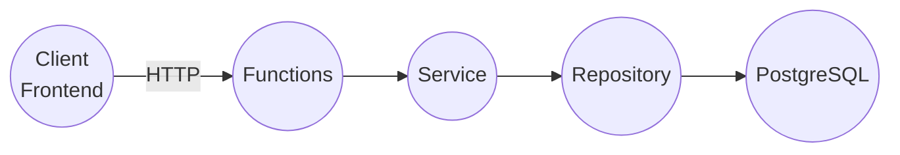

# API層（Azure Functions）

API 層は Azure Functions（.NET / isolated worker）で構成され、`Program.cs` で DI を組み立てています。

## エンドポイント

### `POST /api/ComicData?fromdate=...`

- Function: `ComicData`（HTTP POST）
- 認可: `AuthorizationLevel.Anonymous`
- クエリ: `fromdate`（任意）
  - 未指定時: `DateTime.UtcNow.AddMonths(-1)`
  - 指定時: `DateTime.TryParse` でパースできない場合は例外
- ボディ: `GetComicsRequest`（`searchList` を想定）
- 挙動（実装準拠）
  - `searchList` が空/未指定、または空白のみ → 空配列を返す
  - PostgreSQL へ `salesdate >= fromDate` かつキーワード条件（`title`/`author` の ILIKE）で検索
  - `LIMIT 100`

### `GET /api/ConfigMigration?id=...`

- Function: `ConfigMigrationGet`（HTTP GET、Route=`ConfigMigration`）
- 認可: `AuthorizationLevel.Anonymous`
- クエリ: `id`（大小文字は区別しないパース）
- 返却: `ConfigMigrationGetResponse`（`data: string[]`）
- 挙動（実装準拠）
  - `id` が見つからない → 空配列
  - `id` が見つかった → 値を分割して返し、同時にDBから削除（ワンタイム受け渡し）

### `POST /api/ConfigMigration`

- Function: `ConfigMigrationPost`（HTTP POST、Route=`ConfigMigration`）
- 認可: `AuthorizationLevel.Anonymous`
- ボディ: JSON の `string[]`
- 返却: `ConfigMigrationPostResponse`（`id`）

## 永続化

- 漫画検索: `comic` テーブル
- マイグレーション用一時データ: `configmigration` テーブル（`id` と `value`）
