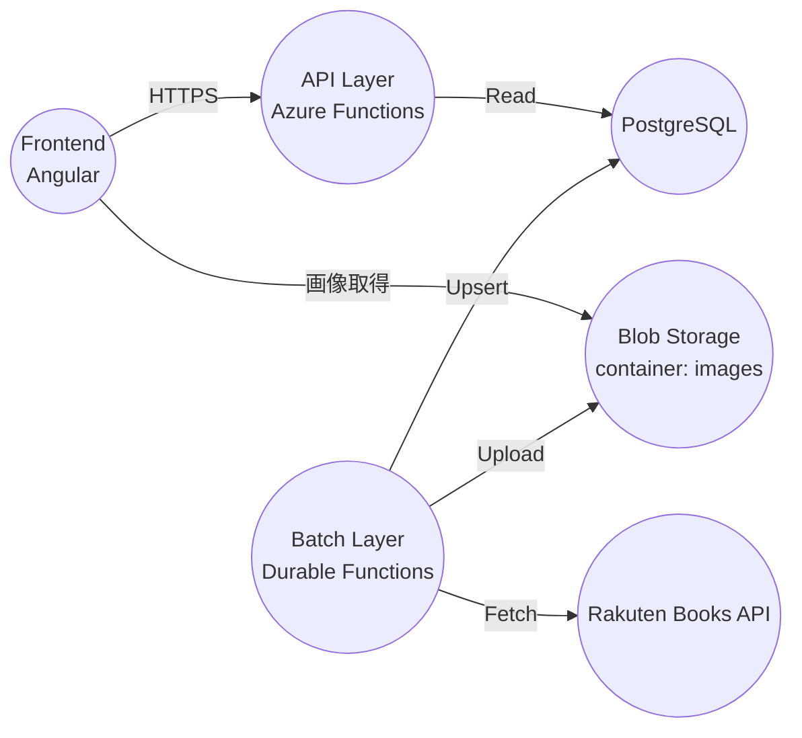

# アーキテクチャ概要

本リポジトリは、Angular フロントエンド + Azure Functions（API/Batch）+ PostgreSQL + Blob Storage で構成されています。

## 構成要素（概観）

## 主要データフロー

- Batch が楽天APIから漫画情報を取得し、`comic` テーブルへ Upsert
- Batch が画像URLを取得し、Blob Storage の `images` コンテナへ `{isbn}.{拡張子}` 形式で保存
- Frontend が検索条件（キーワード・任意の fromDate）を指定して API を呼び出し、一覧を表示
- Frontend が画像を Blob Storage から直接参照（ローカル開発では `environment.blobBaseUrl`）

## 設定（要点）

- PostgreSQL 接続: .NET側は `ConnectionName.DefaultConnection`（= `DefaultConnection`）が使われます
- Blob Storage 認証: `StorageAccountName`（Managed Identity）優先、なければ `StorageConnectionString`
- 楽天API: Batch 側で `applicationid` 設定値を参照
