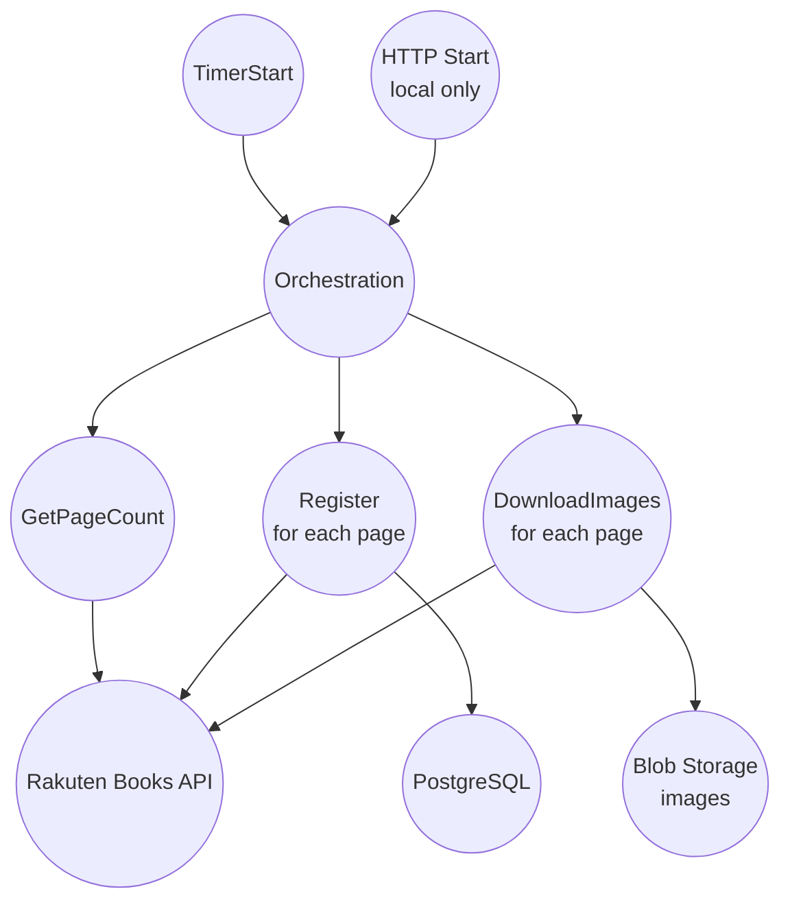

# Batch層（Durable Functions）

Batch 層は Azure Durable Functions を使い、漫画データ取得・登録と画像保存を行います。

## トリガー

### TimerStart

- スケジュール: `0 0 0 * * *`（UTCの毎日 0:00）
- Azure 実行時は「UTC 0:00〜0:05 のみ」実行するガードがあります（ホスト起動時の誤実行を抑止）

### HTTP Start（ローカル開発用）

- `POST /api/orchestration/start`
- Azure 環境（`WEBSITE_INSTANCE_ID` がある）では `403` を返し、ローカル専用

## オーケストレーション概要

- `GetPageCount` でページ数を取得
  - 楽天APIの `page=1` を呼び、レスポンスの `PageCount` を使用
- 登録フェーズ（全ページ）
  - ページ間は 30 秒待機
  - 失敗時は最大 3 回までリトライ（待機: 30, 60, 90 秒…の指数バックオフ）
  - `Register` Activity が `RegitoryAsync(page)` を実行し、`comic` テーブルへ Upsert
- 画像フェーズ（全ページ）
  - 同様に 30 秒待機 + 最大 3 回のリトライ
  - `DownloadImages` Activity が `ProcessImageDownloadsAsync(page)` を実行
  - Blob Storage の `$web` コンテナへ `{isbn}.{拡張子}` で保存（拡張子は Content-Type から決定）
## 楽天API呼び出し（実装上の注意）

- `RakutenComicRepository.Fetch` はレート制限順守のため、呼び出し前に 1 秒待機します
- Batch 側の `HttpClient` は接続枯渇対策として `MaxConnectionsPerServer = 2` 等を設定しています
