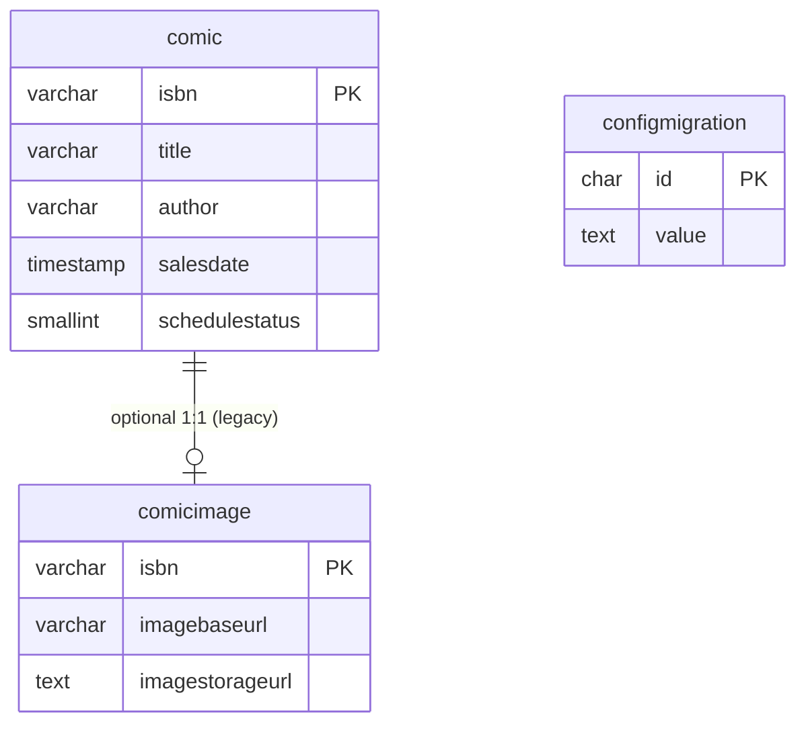

# データベース（PostgreSQL）

DB は PostgreSQL を前提とし、主に漫画情報（`comic`）と一時設定（`configmigration`）を保持します。
完全な定義は既存の [database/SCHEMA.md](../database/SCHEMA.md) を参照してください。

## テーブル（要点）

- `comic`
  - 検索対象のメインテーブル（ISBNを主キー）
  - APIの検索条件は `salesdate >= fromDate` + `title/author` の ILIKE
- `configmigration`
  - フロントの「データ移行（キーワード受け渡し）」用途の一時ストレージ
  - GET で取得したら削除される（ワンタイム）
- `comicimage`
  - 画像情報用のテーブルが存在しますが、現行Batchは Blob Storage へ保存しており、本テーブル更新は確認できません
