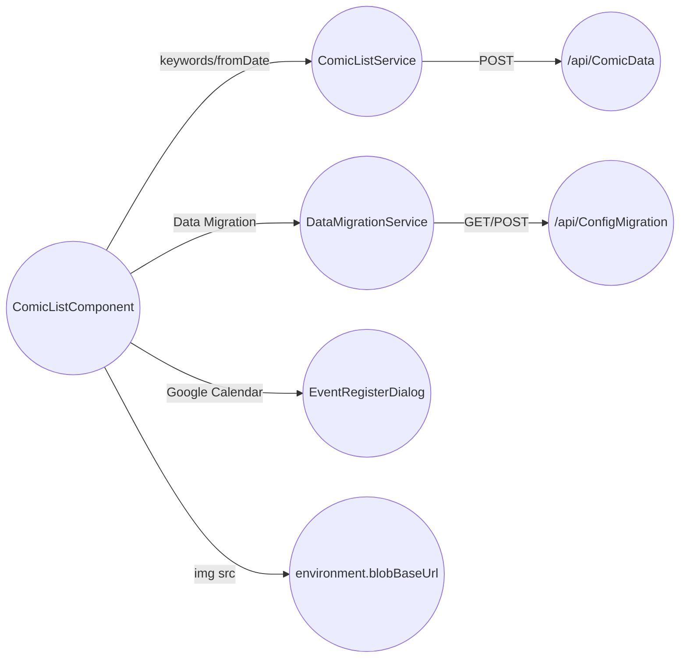

# フロントエンド（Angular）

フロントエンドは Angular アプリで、基本的に「検索条件 → API検索 → 一覧表示 → 画像はBlob直参照」の流れです。

## ルーティング

- ルート `/` は `ComicListComponent` に割り当て（単一ルート構成）

## 検索と表示

- `SearchKeywordsService` がキーワード配列を `localStorage`（キー: `SEARCH_KEYWORDS`）に保存
- キーワード/`fromDate` が更新されるたびに `ComicListService.fetch()` が `/api/ComicData` を呼び出し
- 取得した各アイテムに対して
  - `imageUrl = ${environment.blobBaseUrl}/${isbn}.jpg` を組み立て
  - `DomSanitizer` で `imageUrlSanitize` を生成

## 設定受け渡し（ConfigMigration）

- `DataMigrationSerivce` が `/api/ConfigMigration` を利用
  - `POST` で文字列配列を登録し `id` を受け取る
  - `GET` で `id` を渡して配列を取得（取得後はサーバ側で削除される）

## カレンダー登録

- `EventRegisterDialogComponent` から Google Calendar 連携（`GoogleAuthService` 等）を呼び出す構成
