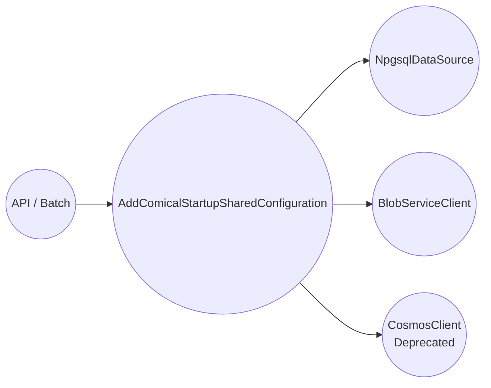

# 共有モジュール（ComiCal.Shared）

`ComiCal.Shared` は API/Batch の両方から参照され、主に「接続設定とクライアント生成」を提供します。

## 登録される主な依存関係

- PostgreSQL
  - `NpgsqlDataSource` を Singleton で登録
  - 接続文字列キー: `ConnectionName.PostgresConnection`（値は `DefaultConnection`）
- Blob Storage
  - `StorageAccountName` がある場合: `DefaultAzureCredential`（Managed Identity 想定）
  - ない場合: `StorageConnectionString`（接続文字列）
- Cosmos DB（Deprecated）
  - `ConnectionName.CosmosConnection`（`CosmosConnectionString`）で `CosmosClient` を登録
  - コメント上「PostgreSQL 移行後に削除予定」
