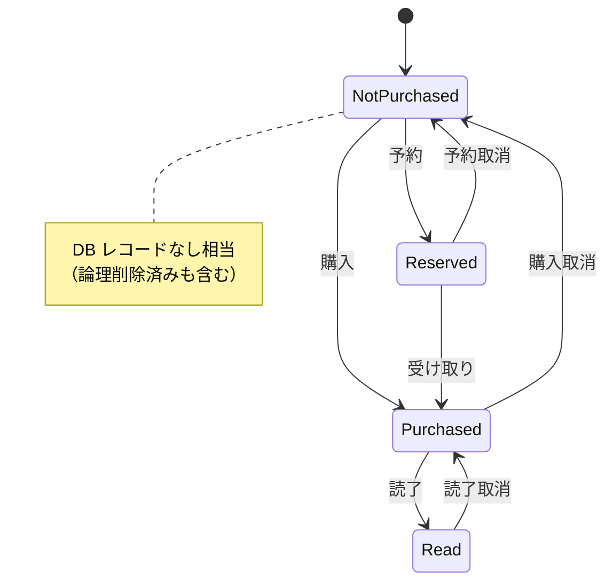

# 03. 機能要件

## 3.1 購読管理

### F-SUB-01 シリーズ購読

- ユーザーはシリーズ（`(NormalizedSeriesName, PrimaryAuthor)` で集約）に対して購読登録ができる。
- ユニーク制約: **1 ユーザー × 1 シリーズ = 最大 1 購読**。
- 購読は論理削除（`IsDeleted` + `DeletedAt`）。再購読時は同一レコードを復活させる。
- 購読解除は確認ダイアログを表示せず即時反映（取り消しはトーストの「元に戻す」5 秒以内）。

### F-SUB-02 購読一覧

- ユーザーの購読シリーズを **発売日昇順** で一覧表示する。
- 「購読中のみ」トグル（**グローバル配置**）で一覧 / カレンダー / 検索結果のフィルタリングが可能。

## 3.2 発売予定 / カレンダー

### F-CAL-01 直近発売予定

- ホーム画面で **直近 30 日 + 既発売 7 日** の発売予定を一覧表示する（既定）。
- 無限スクロール（**keyset pagination**、`(ReleaseDate, VolumeId)` カーソル）で過去 / 未来双方向にロード。

### F-CAL-02 カレンダービュー

- **週ビュー** と **月ビュー** をトグル切替可能。
- 各日のセルにその日発売される巻の表紙サムネイルを最大 N 件（レスポンシブ）表示。タップで詳細。
- 月のみ判明している巻 (`ReleaseDateIsMonthOnly = true`) はその月の **末日** に表示し、バッジで「月内」と注記。
- 日付未定 (`ReleaseDate IS NULL`) の巻は別タブ「未定」に格納。

### F-CAL-03 ビュー切替

- カレンダー ⇄ 一覧ビューはユーザー操作でいつでも切替可能。最後の選択は端末ローカルに永続化。

## 3.3 購入 / 状態管理

### F-PUR-01 巻ごとの購入状態

- ユーザーは各巻に対して以下のいずれかの State を持つ:
  - `NotPurchased`（未購入、初期値、レコードなし相当）
  - `Reserved`（予約中）
  - `Purchased`（購入済）
  - `Read`（読了）
- 電子書籍 / 紙書籍の区別はしない。
- カードの購入チェックボタンで主要な遷移（未購入 → 購入済 → 読了）をワンタップで進められる。

### F-PUR-02 購入の論理削除

- 購入レコードは論理削除のみ（履歴保持目的）。物理削除はアカウント完全削除時のみ。

## 3.4 検索

### F-SRCH-01 検索条件

| フィールド | マッチ |
|---|---|
| タイトル | 部分一致 + **ひらがな正規化** + フルテキスト |
| 著者 | 部分一致 + ひらがな正規化 |
| 発売日 From | 指定日以降 |
| 出版社 | 部分一致（マスタ選択 + フリーテキスト）|

- 検索は **SQL Database のフルテキスト検索 + 計算列**（ひらがな正規化キー）で実現する。`LIKE` は使わない。
- 並び順: 発売日昇順（既定）、関連度順（フルテキストランクスコア）を選択可能。

### F-SRCH-02 検索結果の保存

- MVP では検索条件の保存機能は持たない（将来拡張）。
- URL クエリパラメータに検索条件を保持し、シェア（コピー）と再現が可能。

## 3.5 匿名利用 ⇄ ログイン

### F-AUTH-01 匿名利用

- 未ログイン状態でも全機能を利用可能。
- 購読 / 購入データは **IndexedDB**（`idb-keyval` 等）にユーザー固有の anonymous-id 配下で保存。
- クラウドには一切送信しない。

### F-AUTH-02 ログイン時のマージ

- 初回ログイン時、ローカルに匿名データが存在する場合は以下を選択:
  - **マージ**: ローカル & クラウド両方のデータを統合（同一 SeriesId/VolumeId は最新更新を優先）
  - **上書き（クラウド側採用）**: ローカルデータを破棄
  - **上書き（ローカル側採用）**: クラウドデータをローカル内容で置換
- 選択結果は監査ログに記録（操作日時 + 選択肢）。

### F-AUTH-03 デバイス間同期（匿名）

- 匿名でも **QR コード経由の同期** をサポート。
  - 元端末で QR を発行 → 受け側端末でカメラ読み取り → IndexedDB を一時的に共有メディア（暗号化された Blob URL、TTL 5 分）経由で転送。

### F-AUTH-04 アカウント削除

- ログインユーザーはアカウント削除リクエストが可能。
- フロー: **ソフト削除（`IsDeleted = true`）→ 30 日後にハード削除バッチが物理削除**。
- IdentityLinks も同時に削除し、再ログインで復活しないようにする。

## 3.6 設定

| 項目 | 既定 | 説明 |
|---|---|---|
| 楽天アフィリエイトリンク表示 | ON | カード上の「楽天 Books で見る」ボタンを表示 |
| テーマ | システム追従 | `Light / Dark / System` |
| 「購読中のみ」トグル既定 | OFF | グローバルフィルタ |
| 一覧の既定表示 | カレンダー | カレンダー / 一覧 |

## 3.7 管理者機能

| 機能 | アクセス |
|---|---|
| バッチ手動起動 | Admin ロール + Function Key + Entra 保護 HTTP Trigger |
| シリーズ統合 / 巻数手動補正 | Admin ロールのみ |
| FailedItems の再投入 | Admin ロールのみ |
