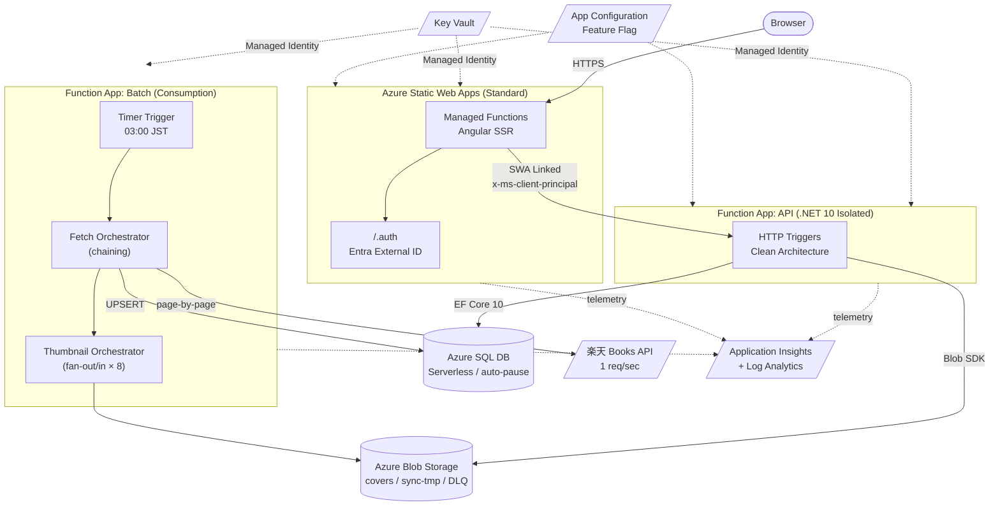
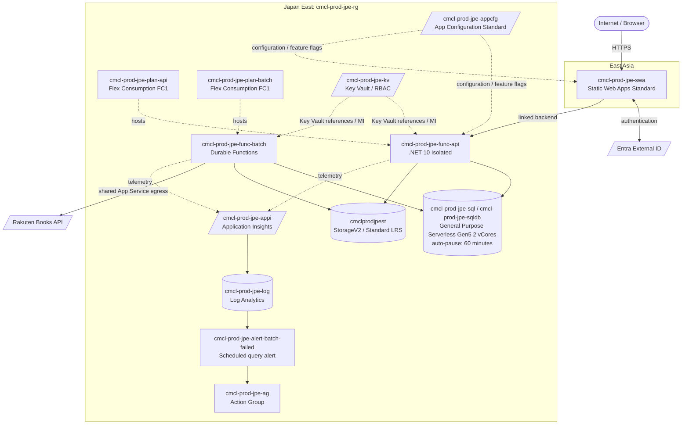

# 06. アーキテクチャ概要

## 6.1 技術スタック（latest = 2026 年 4 月時点）

| 区分 | 採用技術 | 備考 |
|---|---|---|
| Frontend | **Angular v21** + Tailwind CSS **v4** + tailwindcss-typography + Angular CDK | Standalone Components / Signals / Zoneless / SSR (Hybrid) |
| Frontend Hosting | **Azure Static Web Apps Standard** | Managed Functions で SSR 実行 |
| Backend API | **Azure Functions (.NET 10 Isolated Worker)** | SWA-linked Functions |
| Backend Batch | **Azure Functions (.NET 10 Isolated Worker, Consumption)** + **Durable Functions** | バッチは API と物理的に分離 |
| Database | **Azure SQL Database Serverless** (General Purpose, auto-pause) | Database First (SSDT/DACPAC が SoT) |
| ORM | **EF Core 10** | DACPAC からの scaffold |
| Storage | **Azure Blob Storage** | 表紙画像、CDN なし直接配信 |
| Identity | **Entra External ID** (旧 AD B2C) | Microsoft / Google / X(Twitter) |
| Secrets | **Key Vault** + **Managed Identity** | App Settings に KV 参照リンク |
| IaC | **Bicep** | modules: network / data / app / observability |
| 監視 | **Application Insights + Log Analytics** | + Alert Rules |
| Feature Flag | **Azure App Configuration** | Feature Manager 連携 |
| 開発環境 | **DevContainer** | `devcontainers/dotnet` ベース |
| テスト | **Jest** (FE) / **xUnit** (BE) / **Playwright + Testcontainers** (E2E) | カバレッジ ≥ 80% |
| パッケージ管理 | **pnpm workspace**（FE / E2E）+ **dotnet (sln)**（BE）|  |

> Angular v21 はデフォルトテストランナーが Vitest に変更されているが、本プロジェクトは **Jest を継続採用**。

## 6.2 論理構成図

### 6.2.1 現在の Azure 物理構成（2026-09-21 確認時点）

> `cmcl-prod-jpe-rg` は固定エグレス適用前の現行構成です。固定 IP 化 PR #369 の dev デプロイでは VNet、NAT Gateway、静的 Public IP は作成済みですが、Flex Consumption に必要なサブネット委任先の誤りにより Function App の VNet 統合は失敗しています。フォローアップで `Microsoft.App/environments` 委任へ修正し、再デプロイ後にバッチの Rakuten API 通信を NAT Gateway 経由へ切り替えます。

## 6.3 データフロー

1. **収集フロー（バッチ）**: Timer (03:00 JST) → Fetch Orchestrator が楽天 Books API を 1req/sec でページング → Series/Volumes を UPSERT → Thumbnail Orchestrator が新規 / 変更分のみ Blob にダウンロード（CoverHash で同一性判定）。
2. **閲覧フロー**: Browser → SWA SSR → SWA-linked Functions API → SQL/Blob。SSR で Transfer State にデータを埋め込み、ハイドレーション時の再取得を抑制。
3. **書き込みフロー**: ユーザー操作 → SSR を介して Functions に POST/PUT/DELETE。匿名はローカル IndexedDB に書き込みのみ。

## 6.4 環境

| 環境 | 用途 | リソース命名 prefix | コスト最適化 |
|---|---|---|---|
| **dev** | 開発・QA | `cmcl-dev-jpe-*` | SQL auto-pause 60min |
| **prod** | 本番 | `cmcl-prod-jpe-*` | SQL auto-pause 60min |
| **PR Preview** | PR ごと | SWA Preview Environment 自動生成 | dev SQL/Storage を共有 |

- **リージョン: Japan East のみ**（DR 不要）。
- 命名規則: **CAF 推奨** `{prefix}-{env}-{region}-{resource}`。
- 環境差分は `infra/params/{env}.bicepparam` で管理。

## 6.5 トポロジ原則

- **API と Batch は物理的に別 Function App** に分離（スケール特性とデプロイ独立性のため）。
- API は SWA-linked（SWA からのトラフィックのみ受信）。`Authorization=function` + SWA Auth ヘッダで二重防御。
- Batch は HTTP Trigger を Admin 用に 1 つだけ持ち、それ以外はすべて Timer / Durable Activity。
- DB / Storage は両 Function App から同一インスタンスを共有。

## 6.6 可用性 / SLA

- **SLA 目標は無指定（ベストエフォート）**。コスト最小優先。
- DR / マルチリージョン構成は持たない。Azure SQL の自動バックアップ（標準）に依存。

## 6.7 拡張性

- 将来の負荷増加に備え、SQL は **Serverless → Provisioned** へのスケールパスを残す（Bicep param `sql.tier` で切替可能に設計）。
- Blob は CDN 前段化を将来検討（Azure Front Door）。
