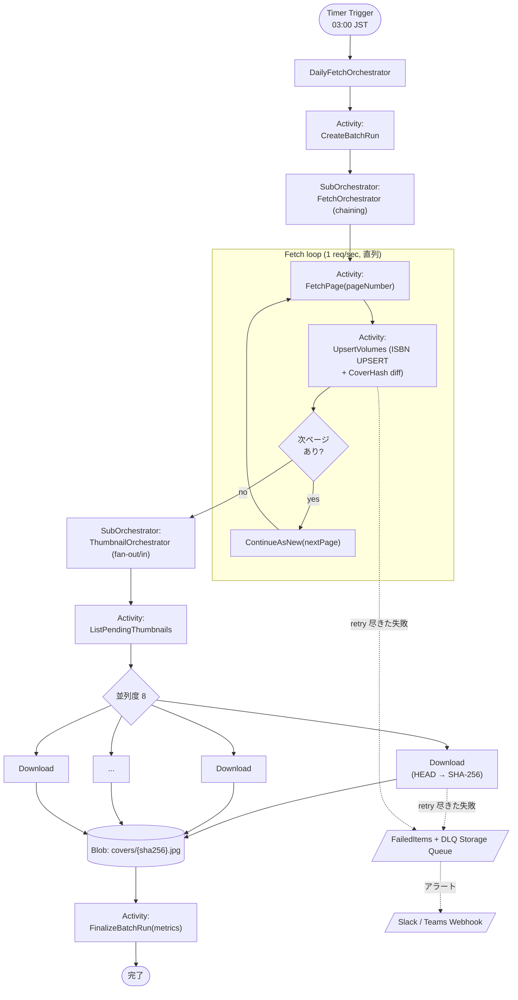

# 09. 楽天 Books API 連携 / バッチ仕様

## 9.1 楽天 Books API

| 項目 | 値 |
|---|---|
| エンドポイント | **BooksBookSearch / 20170404** |
| ジャンル | `booksGenreId = 001001` (コミック) に限定 |
| 認証 | `applicationId` を **App Settings → Key Vault 参照** で注入 |
| Managed Identity | Functions が KV からシークレットを取得 |
| レートリミット | **1 秒 1 リクエスト以下** |
| ページサイズ | 30 件（API 上限）|
| ソート | `releaseDate` 昇順 |
| 取得期間 | これから **6 ヶ月先** まで（初回投入時のみ **6 ヶ月前** も含める）|

### 9.1.1 レートリミッター

- .NET の `System.Threading.RateLimiting.SlidingWindowRateLimiter`（1req/sec）+ Polly のリトライ（指数バックオフ）。
- 429 / 503 受信時は `Retry-After` ヘッダ尊重 + 最大 5 回まで再試行。
- 連続失敗 3 回でアラート（Application Insights → Slack/Teams Webhook）。

### 9.1.2 API レスポンス → ドメインマッピング

| 楽天フィールド | ComiCal フィールド |
|---|---|
| `isbn` | `Volumes.Isbn13`（13 桁検証）|
| `title` | `Series.Title` 抽出 + `Volumes.VolumeNumber` 抽出 |
| `author` | `Authors.Name`（カンマ / ／ で分割）|
| `publisherName` | `Publishers.Name` |
| `salesDate` | `Volumes.ReleaseDate` + `ReleaseDateIsMonthOnly` 判定 |
| `largeImageUrl` | サムネイル取得元 |
| `itemUrl` | `Volumes.RakutenItemUrl` |

## 9.2 Durable Functions バッチ

### 9.2.1 トリガー

- **Timer Trigger**: CRON `0 0 18 * * *` (UTC = 03:00 JST)、毎日 1 回。
- **HTTP Trigger (Admin 手動起動)**: Function Key + Entra 認証 + Admin ロール検証。

### 9.2.2 Orchestrator 構成

### 9.2.3 確定的 (deterministic) ルール

- Orchestrator 内では **DateTime.Now / Random / I/O / Logger を直接使わない**。すべて Activity 経由。
- Activity 失敗時は orchestrator 側の `RetryOptions` を使用（最大 3 回、指数バックオフ）。

### 9.2.4 失敗処理 / DLQ

- Activity 内のリトライ尽きた失敗は **`FailedItems` テーブル + Storage Queue (DLQ)** に書き込む。
- Application Insights カスタムメトリクス `batch.failedItem` を発火。
- 5 件以上 / 単一バッチで Slack/Teams Webhook アラート。

### 9.2.5 冪等性

- Volumes は **ISBN-13 で UPSERT**。複数回投入されても結果は同じ。
- Thumbnail は **CoverHash でスキップ**。Blob のキーは `sha256` で immutable。
- Subscription / Purchase など書込系はバッチからは触らない。

## 9.3 サムネイル仕様

| 項目 | 値 |
|---|---|
| 並列度 | **8** |
| 形式 | 楽天が返す元画像（JPEG）+ オプションで AVIF/WebP 変換（将来）|
| Blob コンテナ | `covers`（public read）|
| キー | `covers/{sha256}.jpg` |
| Cache-Control | `public, max-age=2592000, immutable` |
| Content-Disposition | `inline` |

## 9.4 バッチ実行履歴

`BatchRuns` テーブルに以下を記録:

| カラム | 説明 |
|---|---|
| `BatchRunId` | GUID |
| `StartedAt` / `CompletedAt` | UTC |
| `Status` | `Running` / `Succeeded` / `Failed` / `Cancelled` |
| `FetchedItemCount` | 楽天から取得したアイテム数 |
| `UpsertedVolumeCount` | UPSERT 実行件数 |
| `DownloadedThumbnailCount` | 実際に DL したサムネ数 |
| `SkippedThumbnailCount` | CoverHash 一致でスキップ |
| `FailedItemCount` | 失敗件数 |

## 9.5 観測性

- Orchestrator / Activity の各ステップで `ILogger` 構造化ログ + `OperationId` 伝播。
- Application Insights カスタムメトリクス: `batch.fetchedItems`, `batch.thumbnailDownloads`, `batch.thumbnailCacheHitRate`。
- Kusto クエリは `troubleshoot-batch` Skill にテンプレート化。
