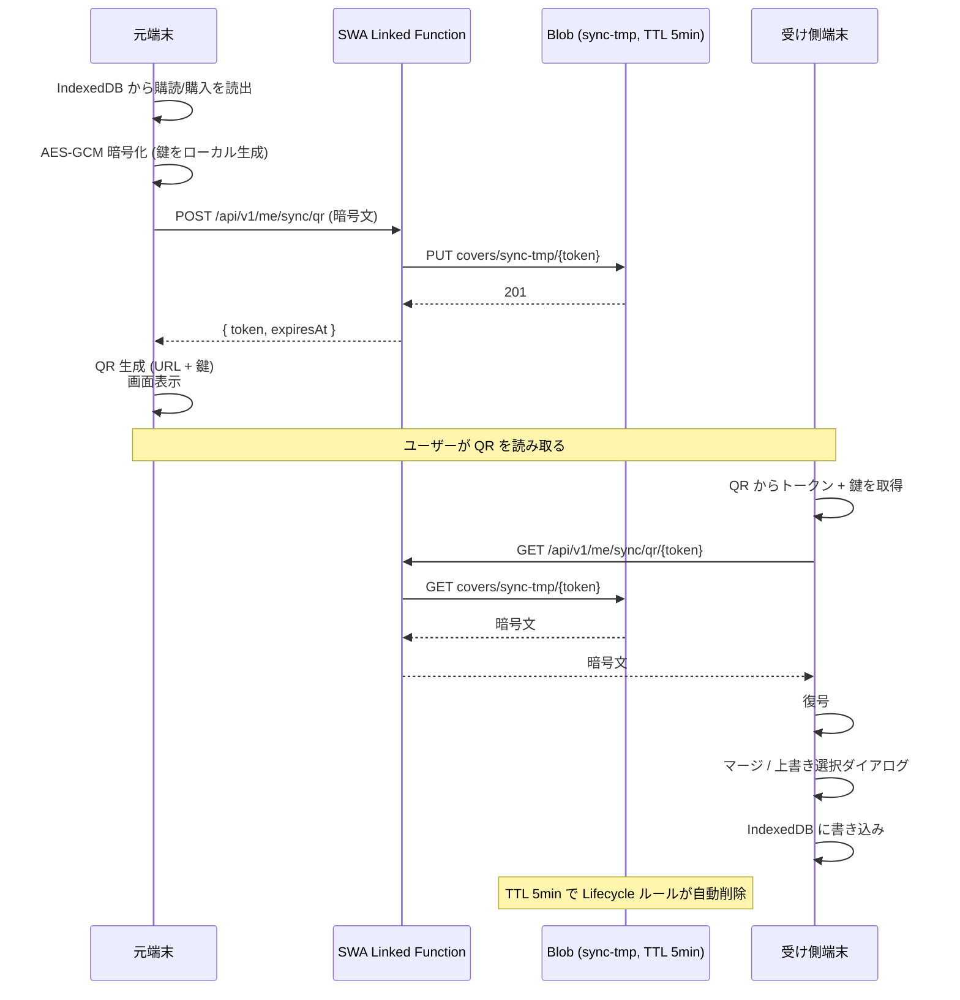

# 11. 認証 / セッション

## 11.1 IdP

- **Entra External ID**（旧 Azure AD B2C）を採用。
- **Microsoft / Google / X(Twitter)** をソーシャル ID プロバイダとして連携。
- SWA の組み込み認証（`/.auth/*`）を経由してフロントから利用。

## 11.2 ユーザー識別

- IdP 側 OID (`Subject`) + `Provider` の組で **`IdentityLinks`** にマッピング。
- 内部は `UserId` (GUID) で統一。Functions のドメイン層は IdP 由来 ID を直接扱わない。
- 初回サインイン時に `Users` + `IdentityLinks` レコードを生成。

## 11.3 セッション

- SWA Auth の Cookie セッション（`/.auth/me` で取得）。
- SSR は `/.auth/me` をプロキシ経由で取得し、Functions API へ転送する Bearer/署名付きヘッダに変換。
- フロント JS から直接 Functions API は呼ばず、**必ず SSR を経由**して呼ぶ（Functions 側は SWA 経由トークンのみ許可）。

## 11.4 ロール

| ロール | 用途 |
|---|---|
| `User` | 一般ユーザー（既定）|
| `Admin` | 運用者。バッチ手動起動 / シリーズ統合等 |

- ロールは `Users.Role` カラムで管理（External ID のクレームには含めない）。
- Admin 昇格は **DB の Post-Deploy シード** または運用 SQL のみ。

## 11.5 匿名利用

### 11.5.1 ローカル保存

- ストレージ: **IndexedDB**（`idb-keyval` 等の薄いラッパ）。
- スキーマ: `subscriptions[]`, `purchases[]`, `settings`, `anonymousId(GUID v4)`。
- クラウドには **送信しない**。

### 11.5.2 端末間同期（QR コード）

1. 元端末: 「QR で同期」ボタン → IndexedDB の中身を AES-GCM 暗号化（鍵はユーザー操作で生成、ローカルに残らない）→ 暗号文を SWA-linked Function 経由で Blob に PUT（TTL 5 分、ランダムキー）。
2. 元端末: Blob URL + 鍵を **QR コード**として画面表示。
3. 受け側端末: QR をカメラで読み取り → Blob から暗号文を GET → 復号 → IndexedDB に書き込み（**マージ / 上書き** をユーザー選択）。
4. Blob は TTL 経過後に自動削除（Lifecycle Management ルール）。

### 11.5.3 ログイン時のマージ

- ログイン直後に **ローカル匿名データの存在を検出** したら、以下のダイアログを表示:
  - **マージ**: ローカル & クラウドの和集合（同一キーは新しい更新を優先）
  - **クラウド優先で上書き**
  - **ローカル優先で上書き**
- 結果は ApplicationInsights に `auth.merge.choice` カスタムイベントで記録（PII 含めない）。

## 11.6 サインアウト

- SWA `/.auth/logout` でセッション破棄。
- ローカル匿名データは保持（次回ログアウト中の利用に備える）。明示的に削除する UI を設定画面に提供。

## 11.7 アカウント削除

- ソフト削除 → 30 日後ハード削除（バッチ）。
- ソフト削除中はログイン不可（`IsDeleted` チェックでブロック）。
- ハード削除では `Users` / `IdentityLinks` / `Subscriptions` / `Purchases` を物理削除。`BatchRuns` 等の運用ログには UserId を含めない方針なので影響なし。

## 11.8 セキュリティ要件

- すべての認証付き API は **SWA Linked Functions の `Authorization=function`**（SWA 経由限定）。
- Functions ミドルウェアで以下を検証:
  - `x-ms-client-principal` ヘッダの存在と Subject。
  - `IdentityLinks` への解決。
  - `Users.IsDeleted = 0`。
- Anti-CSRF: SWA + same-site cookie + SSR-only state-changing endpoints。
- セッション固定攻撃対策: SWA Auth の標準実装に依存。

## 11.9 プライバシー / 利用規約

- `/legal/privacy`, `/legal/terms` を **静的ページ**として同梱。
- 初回サインアップ時に同意チェックを必須化（同意日時を `Users.AgreedAt` 列に記録）。
