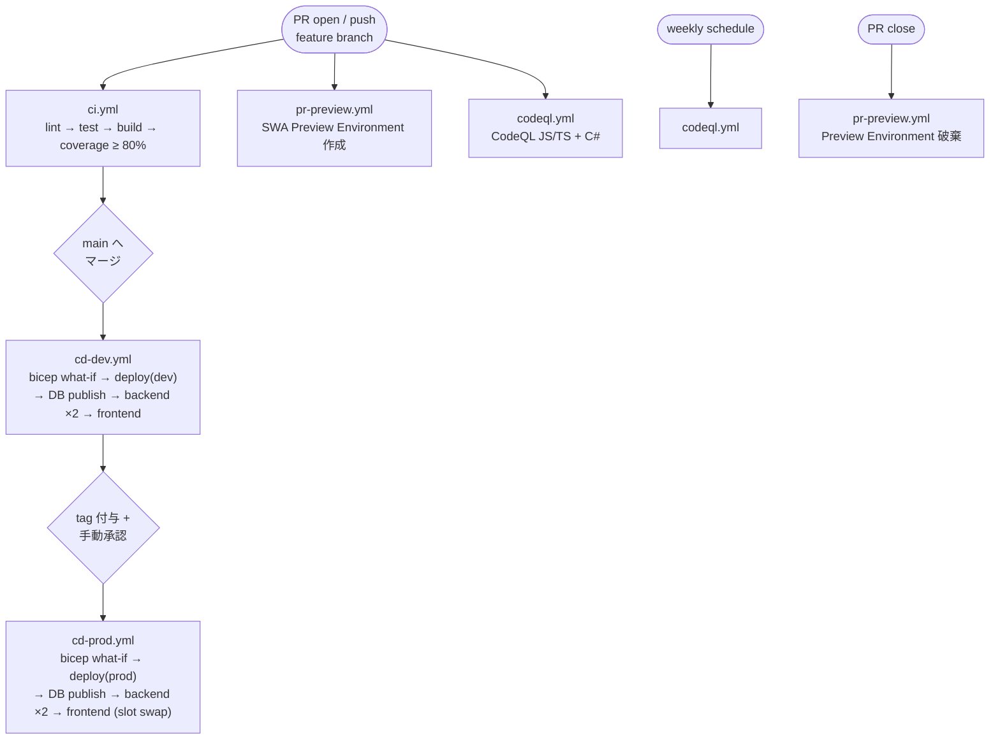

# 17. CI / CD / リリース

## 17.1 パイプライン全体像

## 17.2 ワークフロー仕様

| ファイル | トリガ | ステップ |
|---|---|---|
| `.github/workflows/ci.yml` | PR / push | `lint` (eslint, prettier, dotnet format) → `test` (jest, xunit, e2e で smoke のみ) → `build` (frontend SSR / backend / sqlproj) → coverage gate (80%) |
| `.github/workflows/cd-dev.yml` | main push | `bicep what-if` → `bicep deploy` → `sqlpackage publish` → `func publish` ×2 → `swa deploy` |
| `.github/workflows/cd-prod.yml` | manual_dispatch + tag | dev と同じ順序、Environment 保護で承認 1 名必須 |
| `.github/workflows/pr-preview.yml` | PR open / sync / close | SWA Preview Environment 作成 / 削除 |
| `.github/workflows/codeql.yml` | weekly + PR | CodeQL JS/TS + C# |

## 17.3 セキュリティ要件

- **OIDC + Federated Credential** で Azure に認証（クライアントシークレットなし）。
- すべての `uses:` は **完全な SHA でピン留め**（タグ参照禁止）。例: `uses: actions/checkout@b4ffde65f46336ab88eb53be808477a3936bae11 # v4.1.1`。
- `permissions:` を最小化（既定 `contents: read`、ジョブ単位で必要分のみ拡大）。
- Secret は Environment Secret + OIDC で取得。

## 17.4 PR 品質ゲート

- **ESLint / Prettier**（フロント）。
- **`dotnet format` / Roslyn analyzers**（バック）。
- **Conventional Commits + PR title check**（`feat:` / `fix:` / `chore:` / `docs:` / `test:` / `refactor:` 等）。
- **CodeQL / Dependabot**。
- **Coverage ≥ 80%**。
- **Bicep what-if** が変更を検出した場合、PR コメントで diff 表示。

## 17.5 ブランチ戦略

- **Trunk-based**：`main` 一本 + 短寿命 feature branch。
- リリースは **タグ駆動**（`v1.2.3`）で `cd-prod.yml` を起動。
- ホットフィックスは `main` から短寿命ブランチを切り、即タグ。

## 17.6 リリースフロー

1. main へマージ → **dev に自動デプロイ**。
2. 手動で **本番リリース承認** → タグ付与 → `cd-prod.yml` が走る。
3. 本番は **slot 運用**（slot `staging` → swap）。
4. SWA / Functions 共に **段階的リリース**（Feature Flag で機能を OFF → 段階 ON）。

## 17.7 Feature Flag

- **Azure App Configuration** + Feature Manager。
- 用途:
  - **Entra External ID ログインの段階ロールアウト**（一定割合のユーザー）。
  - レコメンド / ディスカバリ機能（`discovery.*`）。
  - カレンダービュー A/B テスト。
- 命名: `kebab-case`、削除予定日 (`removalDate`) を Bicep param に記録。
- 切替は ADR を起こしてから行う。

## 17.8 SWA Preview Environment

- PR 作成時に **自動生成**、レビュアーが動作確認可能。
- バックエンドは dev 環境を共有（書込テストはシード分離）。
- PR クローズで自動破棄。

## 17.9 PR テンプレート

- 変更概要 / スクリーンショット / テスト追加状況 / Bicep what-if 差分 / フィーチャフラグ更新 / breaking change の有無。

## 17.10 リリースノート

- Conventional Commits から **release-please** で自動生成（GitHub Releases）。
- MIT ライセンス OSS のため公開リリースノートを GitHub Releases に同期。
