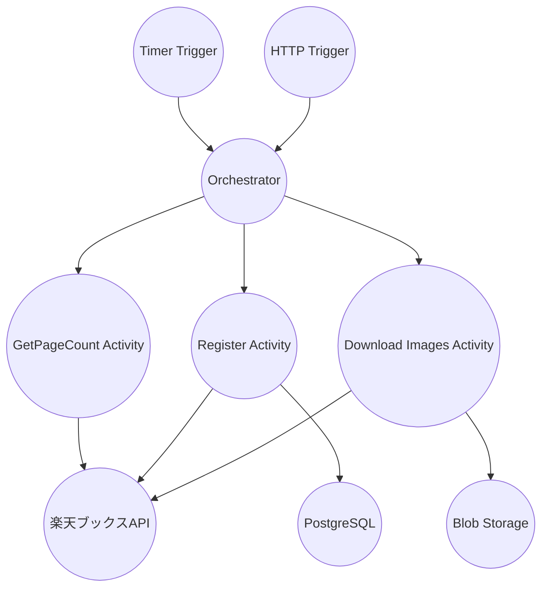

# ComiCal Batch (Durable Functions)

Azure Durable Functions を使用したバッチ処理層。楽天ブックスAPIからの漫画データ取得・登録と画像ダウンロードを行います。

## 構成

- **実行環境**: Azure Durable Functions v4, .NET 10 Isolated worker model
- **オーケストレーション**: Durable Functions のワークフロー機能
- **外部API**: 楽天ブックスAPI
- **ストレージ**: Azure Blob Storage (画像保存)
- **データベース**: PostgreSQL (漫画データ保存)

## 処理フロー



## トリガー

### Timer Trigger (本番)

- **スケジュール**: `0 0 0 * * *` (毎日UTC 00:00)
- **実行条件**: Azure環境では UTC 00:00-00:05 の間のみ実行
- **用途**: 毎日の漫画データ更新

### HTTP Trigger (開発)

- **エンドポイント**: `POST /api/orchestration/start`
- **用途**: ローカル開発での手動実行・デバッグ
- **認証レベル**: Anonymous (ローカル開発のみ)

## Activity Functions

### 1. GetPageCount Activity

楽天ブックスAPIから取得可能な総ページ数を取得

### 2. Register Activity  

各ページの漫画データを楽天ブックスAPIから取得し、PostgreSQLにupsert

- 重複チェック: ISBN による
- データ更新: 既存データがある場合は更新
- バッチサイズ: ページ単位（通常30件/ページ）

### 3. Download Images Activity

各ページの漫画の画像をダウンロードし、Blob Storageに保存

- 保存形式: `{ISBN}.{拡張子}` (例: `9784123456789.jpg`)
- コンテナ: `images`
- 重複処理: 既存画像はスキップ

## ローカル開発

### 前提条件

- .NET 10 SDK
- Azure Functions Core Tools v4
- PostgreSQL (DevContainerで提供)
- Azurite (DevContainerで提供)

### 設定

1. **設定ファイルの作成**:
```bash
cp local.settings.json.template local.settings.json
```

2. **楽天API applicationIdの設定**:

`local.settings.json` に楽天ブックスAPIのアプリケーションIDを設定：

```json
{
  "IsEncrypted": false,
  "Values": {
    "AzureWebJobsStorage": "DefaultEndpointsProtocol=http;AccountName=devstoreaccount1;...",
    "FUNCTIONS_WORKER_RUNTIME": "dotnet-isolated",
    "PostgresConnectionString": "Host=postgres;Port=5432;Database=comical;Username=comical;Password=comical_dev_password",
    "StorageConnectionString": "DefaultEndpointsProtocol=http;AccountName=devstoreaccount1;...",
    "applicationid": "YOUR_RAKUTEN_APPLICATION_ID"
  }
}
```

### 起動

```bash
func start --port 7072
```

- APIとは別ポートで起動することを推奨
- タイマートリガーはローカルでは無効（HTTP トリガーを使用）

### 手動実行

ローカル環境でのバッチ処理の手動実行：

```bash
# オーケストレーションの開始
curl -X POST http://localhost:7072/api/orchestration/start
```

## デバッグ・トラブルシューティング

### バッチジョブの個別実行

特定のジョブタイプを指定して実行：

```bash
# データ登録ジョブの実行
cd /workspaces/ComiCal/src/ComiCal.Server/ComiCal.Batch
BATCH_JOB_TYPE=DataRegistration dotnet run

# 画像ダウンロードジョブの実行
BATCH_JOB_TYPE=ImageDownload dotnet run
```

### 環境変数の設定確認

```bash
# 開発環境として実行
ASPNETCORE_ENVIRONMENT=Development dotnet run

# 環境変数の確認
echo $ASPNETCORE_ENVIRONMENT
echo $BATCH_JOB_TYPE
```

### バッチ状態のリセット

バッチ処理が失敗状態や遅延状態でスタックした場合：

```bash
# バッチ状態とエラー情報をクリア
cd /workspaces/ComiCal/src/database
PGPASSWORD=comical_dev_password psql -h postgres -U comical -d comical -c "
BEGIN;
DELETE FROM batch_page_errors;
DELETE FROM batch_states;
COMMIT;
SELECT 'Batch states reset successfully' as result;
"
```

### バッチ状態の確認

```bash
# 現在のバッチ状態を確認
PGPASSWORD=comical_dev_password psql -h postgres -U comical -d comical -c "
SELECT id, batch_date, status, registration_phase, image_download_phase, delayed_until, retry_attempts 
FROM batch_states 
ORDER BY created_at DESC 
LIMIT 5;
"

# バッチエラーの確認
PGPASSWORD=comical_dev_password psql -h postgres -U comical -d comical -c "
SELECT batch_state_id, page_number, error_count, last_error_message 
FROM batch_page_errors 
ORDER BY updated_at DESC 
LIMIT 10;
"
```

### 設定の診断

```bash
# 設定値のデバッグ出力を確認
dotnet run | grep "DEBUG:"

# 楽天APIキーの設定確認（マスクして表示）
cd /workspaces/ComiCal/src/ComiCal.Server/ComiCal.Batch
grep "RakutenApiKey" appsettings.Development.json
```

### よくある問題と解決方法

1. **"Job type mismatch" エラー**
   - 原因: `BATCH_JOB_TYPE` 環境変数が未設定
   - 解決: 上記の個別実行コマンドを使用

2. **"Azure Storage configuration is missing" エラー**
   - 原因: `ASPNETCORE_ENVIRONMENT` が Production に設定されている
   - 解決: Development 環境で実行

3. **"client_id or access_token is required" エラー**
   - 原因: RakutenApiKey の設定キー名の不一致
   - 解決: コードで `configuration["RakutenApiKey"]` を使用するよう修正済み

4. **バッチが遅延状態でスタック**
   - 原因: 前回の失敗によりリトライ待機中
   - 解決: バッチ状態リセットコマンドを実行

## 本番環境

### Azure環境での設定

Application Settings で以下を設定：

- `FUNCTIONS_WORKER_RUNTIME`: `dotnet-isolated`
- `PostgresConnectionString`: Managed Identity使用を推奨
- `StorageAccountName`: Managed Identity認証用
- `applicationid`: 楽天ブックスAPI のアプリケーションID

### セキュリティ

- Managed Identity でデータベース・ストレージアクセス
- 楽天API キーの安全な管理
- タイマー実行時間の制限（誤実行防止）

## Services

### JobSchedulingService

オーケストレーションの全体制御とワークフロー管理

### JobTriggerService

外部APIトリガーとHTTPエンドポイントの管理

### BatchStateService

バッチ処理の状態管理とエラーハンドリング

### ComicService

漫画データの取得・登録・更新ロジック

### PartialRetryService

部分的な失敗時のリトライ機能

## プロジェクト構造

```
ComiCal.Batch/
├── Jobs/               # Activity Functions
├── Services/           # ビジネスロジック・サービス層
├── Models/             # データモデル・DTOクラス
├── Repositories/       # 楽天API・データアクセス層
├── Util/              # ユーティリティクラス
├── Program.cs         # DI設定・アプリケーション構成
├── host.json         # Functions ホスト設定
└── local.settings.json # ローカル環境設定
```

## 依存関係

主要なNuGetパッケージ：
- `Microsoft.Azure.Functions.Worker`
- `Microsoft.Azure.Functions.Worker.Extensions.DurableTask`
- `Microsoft.EntityFrameworkCore.Design`
- `Npgsql.EntityFrameworkCore.PostgreSQL`
- `Azure.Storage.Blobs`